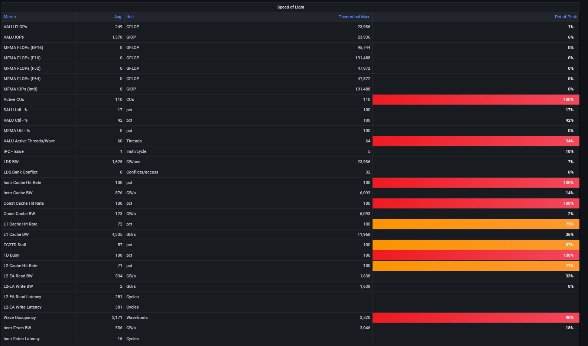

# Analyze Mode

```eval_rst
.. toctree::
   :glob:
   :maxdepth: 4
```
Omniperf offers several ways to interact with the metrics it generates from profiling. The option you choose will likey be influnced by your familiarity with the profiled application, computing enviroment, and experience with Omniperf.

While analyzing with the CLI offers quick and straightforward access to Omniperf metrics from terminal, the GUI adds an extra layer of styling and interactiveness some users may prefer.

See sections below for more information on each.

## CLI Analysis
> Profiling results from the [aforementioned vcopy workload](https://rocm.github.io/omniperf/profiling.html#workload-compilation) will be used in the following sections to demonstrate the use of Omniperf in MI GPU performance analysis. Unless otherwise noted, the performance analysis is done on the MI200 platform.

### Features

- All Omniperf built-in metrics.
- Multiple runs base line comparison.
- Metrics customization: pick up subset of build-in metrics or build your own profiling configuration.
- Kernel, gpu-id, dispatch-id filters.

Run `omniperf analyze -h` for more details.

### Recommended workflow

1) To begin, generate a comprehensive analysis report with Omniperf CLI.
```shell-session
$ omniperf analyze -p workloads/vcopy/mi200/

--------
Analyze
--------


--------------------------------------------------------------------------------
0. Top Stat
╒════╤══════════════════════════════════════════╤═════════╤═══════════╤════════════╤══════════════╤════════╕
│    │ KernelName                               │   Count │   Sum(ns) │   Mean(ns) │   Median(ns) │    Pct │
╞════╪══════════════════════════════════════════╪═════════╪═══════════╪════════════╪══════════════╪════════╡
│  0 │ vecCopy(double*, double*, double*, int,  │       1 │  20000.00 │   20000.00 │     20000.00 │ 100.00 │
│    │ int) [clone .kd]                         │         │           │            │              │        │
╘════╧══════════════════════════════════════════╧═════════╧═══════════╧════════════╧══════════════╧════════╛


--------------------------------------------------------------------------------
1. System Info
╒══════════════════╤═══════════════════════════════════════════════╕
│                  │ Info                                          │
╞══════════════════╪═══════════════════════════════════════════════╡
│ workload_name    │ vcopy                                         │
├──────────────────┼───────────────────────────────────────────────┤
│ command          │ /home/colramos/vcopy 1048576 256              │
├──────────────────┼───────────────────────────────────────────────┤
│ host_name        │ sv-pdp-2                                      │
├──────────────────┼───────────────────────────────────────────────┤
│ host_cpu         │ AMD EPYC 7282 16-Core Processor               │
├──────────────────┼───────────────────────────────────────────────┤
│ host_distro      │ Ubuntu 20.04.3 LTS                            │
├──────────────────┼───────────────────────────────────────────────┤
│ host_kernel      │ 5.15.0-43-generic                             │
├──────────────────┼───────────────────────────────────────────────┤
│ host_rocmver     │ 5.2.1-79                                      │
├──────────────────┼───────────────────────────────────────────────┤
│ date             │ Fri Jan 20 11:22:20 2023 (CST)                │
├──────────────────┼───────────────────────────────────────────────┤
│ gpu_soc          │ gfx90a                                        │
├──────────────────┼───────────────────────────────────────────────┤
│ numSE            │ 8                                             │
├──────────────────┼───────────────────────────────────────────────┤
│ numCU            │ 104                                           │
├──────────────────┼───────────────────────────────────────────────┤
│ numSIMD          │ 4                                             │
├──────────────────┼───────────────────────────────────────────────┤
│ waveSize         │ 64                                            │
├──────────────────┼───────────────────────────────────────────────┤
│ maxWavesPerCU    │ 32                                            │
├──────────────────┼───────────────────────────────────────────────┤
│ maxWorkgroupSize │ 1024                                          │
├──────────────────┼───────────────────────────────────────────────┤
│ L1               │ 16                                            │
├──────────────────┼───────────────────────────────────────────────┤
│ L2               │ 8192                                          │
├──────────────────┼───────────────────────────────────────────────┤
│ sclk             │ 1700                                          │
├──────────────────┼───────────────────────────────────────────────┤
│ mclk             │ 1600                                          │
├──────────────────┼───────────────────────────────────────────────┤
│ cur_sclk         │ 800                                           │
├──────────────────┼───────────────────────────────────────────────┤
│ cur_mclk         │ 1600                                          │
├──────────────────┼───────────────────────────────────────────────┤
│ L2Banks          │ 32                                            │
├──────────────────┼───────────────────────────────────────────────┤
│ name             │ mi200                                         │
├──────────────────┼───────────────────────────────────────────────┤
│ numSQC           │ 56                                            │
├──────────────────┼───────────────────────────────────────────────┤
│ hbmBW            │ 1638.4                                        │
├──────────────────┼───────────────────────────────────────────────┤
│ ip_blocks        │ roofline|SQ|LDS|SQC|TA|TD|TCP|TCC|SPI|CPC|CPF │
╘══════════════════╧═══════════════════════════════════════════════╛


--------------------------------------------------------------------------------
2. System Speed-of-Light
....
```
 2. Use `--list-metrics` to generate a list of availible metrics for inspection
 ```shell-session
$ omniperf analyze -p workloads/vcopy/mi200/ --list-metrics gfx90a
╒═════════╤═════════════════════════════╕
│         │ Metric                      │
╞═════════╪═════════════════════════════╡
│ 0       │ Top Stat                    │
├─────────┼─────────────────────────────┤
│ 1       │ System Info                 │
├─────────┼─────────────────────────────┤
│ 2.1.0   │ VALU_FLOPs                  │
├─────────┼─────────────────────────────┤
│ 2.1.1   │ VALU_IOPs                   │
├─────────┼─────────────────────────────┤
│ 2.1.2   │ MFMA_FLOPs_(BF16)           │
├─────────┼─────────────────────────────┤
│ 2.1.3   │ MFMA_FLOPs_(F16)            │
├─────────┼─────────────────────────────┤
│ 2.1.4   │ MFMA_FLOPs_(F32)            │
├─────────┼─────────────────────────────┤
│ 2.1.5   │ MFMA_FLOPs_(F64)            │
├─────────┼─────────────────────────────┤
│ 2.1.6   │ MFMA_IOPs_(Int8)            │
├─────────┼─────────────────────────────┤
│ 2.1.7   │ Active_CUs                  │
├─────────┼─────────────────────────────┤
│ 2.1.8   │ SALU_Util                   │
├─────────┼─────────────────────────────┤
│ 2.1.9   │ VALU_Util                   │
├─────────┼─────────────────────────────┤
│ 2.1.10  │ MFMA_Util                   │
├─────────┼─────────────────────────────┤
│ 2.1.11  │ VALU_Active_Threads/Wave    │
├─────────┼─────────────────────────────┤
│ 2.1.12  │ IPC_-_Issue                 │
├─────────┼─────────────────────────────┤
│ 2.1.13  │ LDS_BW                      │
├─────────┼─────────────────────────────┤
│ 2.1.14  │ LDS_Bank_Conflict           │
├─────────┼─────────────────────────────┤
│ 2.1.15  │ Instr_Cache_Hit_Rate        │
├─────────┼─────────────────────────────┤
│ 2.1.16  │ Instr_Cache_BW              │
├─────────┼─────────────────────────────┤
│ 2.1.17  │ Scalar_L1D_Cache_Hit_Rate   │
├─────────┼─────────────────────────────┤
│ 2.1.18  │ Scalar_L1D_Cache_BW         │
├─────────┼─────────────────────────────┤
│ 2.1.19  │ Vector_L1D_Cache_Hit_Rate   │
├─────────┼─────────────────────────────┤
│ 2.1.20  │ Vector_L1D_Cache_BW         │
├─────────┼─────────────────────────────┤
│ 2.1.21  │ L2_Cache_Hit_Rate           │
├─────────┼─────────────────────────────┤
│ 2.1.22  │ L2-Fabric_Read_BW           │
├─────────┼─────────────────────────────┤
│ 2.1.23  │ L2-Fabric_Write_BW          │
├─────────┼─────────────────────────────┤
│ 2.1.24  │ L2-Fabric_Read_Latency      │
├─────────┼─────────────────────────────┤
│ 2.1.25  │ L2-Fabric_Write_Latency     │
├─────────┼─────────────────────────────┤
...
 ```
 2. Choose your own customized subset of metrics with `-b` (a.k.a. `--metric`), or build your own config following [config_template](https://github.com/ROCm/omniperf/blob/amd-mainline/src/rocprof_compute_analyze/configs/panel_config_template.yaml). Below shows how to generate a report containing only metric 2 (a.k.a. System Speed-of-Light).
```shell-session
$ omniperf analyze -p workloads/vcopy/mi200/ -b 2
--------
Analyze
--------

--------------------------------------------------------------------------------
0. Top Stat
╒════╤══════════════════════════════════════════╤═════════╤═══════════╤════════════╤══════════════╤════════╕
│    │ KernelName                               │   Count │   Sum(ns) │   Mean(ns) │   Median(ns) │    Pct │
╞════╪══════════════════════════════════════════╪═════════╪═══════════╪════════════╪══════════════╪════════╡
│  0 │ vecCopy(double*, double*, double*, int,  │       1 │  20000.00 │   20000.00 │     20000.00 │ 100.00 │
│    │ int) [clone .kd]                         │         │           │            │              │        │
╘════╧══════════════════════════════════════════╧═════════╧═══════════╧════════════╧══════════════╧════════╛


--------------------------------------------------------------------------------
2. System Speed-of-Light
╒═════════╤═══════════════════════════╤═══════════════════════╤══════════════════╤════════════════════╤════════════════════════╕
│ Index   │ Metric                    │ Value                 │ Unit             │ Peak               │ PoP                    │
╞═════════╪═══════════════════════════╪═══════════════════════╪══════════════════╪════════════════════╪════════════════════════╡
│ 2.1.0   │ VALU FLOPs                │ 0.0                   │ Gflop            │ 22630.4            │ 0.0                    │
├─────────┼───────────────────────────┼───────────────────────┼──────────────────┼────────────────────┼────────────────────────┤
│ 2.1.1   │ VALU IOPs                 │ 367.0016              │ Giop             │ 22630.4            │ 1.6217194570135745     │
├─────────┼───────────────────────────┼───────────────────────┼──────────────────┼────────────────────┼────────────────────────┤
│ 2.1.2   │ MFMA FLOPs (BF16)         │ 0.0                   │ Gflop            │ 90521.6            │ 0.0                    │
├─────────┼───────────────────────────┼───────────────────────┼──────────────────┼────────────────────┼────────────────────────┤
│ 2.1.3   │ MFMA FLOPs (F16)          │ 0.0                   │ Gflop            │ 181043.2           │ 0.0                    │
├─────────┼───────────────────────────┼───────────────────────┼──────────────────┼────────────────────┼────────────────────────┤
│ 2.1.4   │ MFMA FLOPs (F32)          │ 0.0                   │ Gflop            │ 45260.8            │ 0.0                    │
├─────────┼───────────────────────────┼───────────────────────┼──────────────────┼────────────────────┼────────────────────────┤
│ 2.1.5   │ MFMA FLOPs (F64)          │ 0.0                   │ Gflop            │ 45260.8            │ 0.0                    │
├─────────┼───────────────────────────┼───────────────────────┼──────────────────┼────────────────────┼────────────────────────┤
│ 2.1.6   │ MFMA IOPs (Int8)          │ 0.0                   │ Giop             │ 181043.2           │ 0.0                    │
├─────────┼───────────────────────────┼───────────────────────┼──────────────────┼────────────────────┼────────────────────────┤
│ 2.1.7   │ Active CUs                │ 74                    │ Cus              │ 104                │ 71.15384615384616      │
├─────────┼───────────────────────────┼───────────────────────┼──────────────────┼────────────────────┼────────────────────────┤
│ 2.1.8   │ SALU Util                 │ 4.016057506716307     │ Pct              │ 100                │ 4.016057506716307      │
├─────────┼───────────────────────────┼───────────────────────┼──────────────────┼────────────────────┼────────────────────────┤
│ 2.1.9   │ VALU Util                 │ 5.737225009594725     │ Pct              │ 100                │ 5.737225009594725      │
├─────────┼───────────────────────────┼───────────────────────┼──────────────────┼────────────────────┼────────────────────────┤
│ 2.1.10  │ MFMA Util                 │ 0.0                   │ Pct              │ 100                │ 0.0                    │
├─────────┼───────────────────────────┼───────────────────────┼──────────────────┼────────────────────┼────────────────────────┤
│ 2.1.11  │ VALU Active Threads/Wave  │ 64.0                  │ Threads          │ 64                 │ 100.0                  │
├─────────┼───────────────────────────┼───────────────────────┼──────────────────┼────────────────────┼────────────────────────┤
│ 2.1.12  │ IPC - Issue               │ 1.0                   │ Instr/cycle      │ 5                  │ 20.0                   │
├─────────┼───────────────────────────┼───────────────────────┼──────────────────┼────────────────────┼────────────────────────┤
│ 2.1.13  │ LDS BW                    │ 0.0                   │ Gb/sec           │ 22630.4            │ 0.0                    │
├─────────┼───────────────────────────┼───────────────────────┼──────────────────┼────────────────────┼────────────────────────┤
│ 2.1.14  │ LDS Bank Conflict         │                       │ Conflicts/access │ 32                 │                        │
├─────────┼───────────────────────────┼───────────────────────┼──────────────────┼────────────────────┼────────────────────────┤
│ 2.1.15  │ Instr Cache Hit Rate      │ 99.91306912556854     │ Pct              │ 100                │ 99.91306912556854      │
├─────────┼───────────────────────────┼───────────────────────┼──────────────────┼────────────────────┼────────────────────────┤
│ 2.1.16  │ Instr Cache BW            │ 209.7152              │ Gb/s             │ 6092.8             │ 3.442016806722689      │
├─────────┼───────────────────────────┼───────────────────────┼──────────────────┼────────────────────┼────────────────────────┤
│ 2.1.17  │ Scalar L1D Cache Hit Rate │ 99.81986908342313     │ Pct              │ 100                │ 99.81986908342313      │
├─────────┼───────────────────────────┼───────────────────────┼──────────────────┼────────────────────┼────────────────────────┤
│ 2.1.18  │ Scalar L1D Cache BW       │ 209.7152              │ Gb/s             │ 6092.8             │ 3.442016806722689      │
├─────────┼───────────────────────────┼───────────────────────┼──────────────────┼────────────────────┼────────────────────────┤
│ 2.1.19  │ Vector L1D Cache Hit Rate │ 50.0                  │ Pct              │ 100                │ 50.0                   │
├─────────┼───────────────────────────┼───────────────────────┼──────────────────┼────────────────────┼────────────────────────┤
│ 2.1.20  │ Vector L1D Cache BW       │ 1677.7216             │ Gb/s             │ 11315.199999999999 │ 14.82714932126697      │
├─────────┼───────────────────────────┼───────────────────────┼──────────────────┼────────────────────┼────────────────────────┤
│ 2.1.21  │ L2 Cache Hit Rate         │ 35.55067615693325     │ Pct              │ 100                │ 35.55067615693325      │
├─────────┼───────────────────────────┼───────────────────────┼──────────────────┼────────────────────┼────────────────────────┤
│ 2.1.22  │ L2-Fabric Read BW         │ 419.8496              │ Gb/s             │ 1638.4             │ 25.6255859375          │
├─────────┼───────────────────────────┼───────────────────────┼──────────────────┼────────────────────┼────────────────────────┤
│ 2.1.23  │ L2-Fabric Write BW        │ 293.9456              │ Gb/s             │ 1638.4             │ 17.941015625           │
├─────────┼───────────────────────────┼───────────────────────┼──────────────────┼────────────────────┼────────────────────────┤
│ 2.1.24  │ L2-Fabric Read Latency    │ 256.6482321288385     │ Cycles           │                    │                        │
├─────────┼───────────────────────────┼───────────────────────┼──────────────────┼────────────────────┼────────────────────────┤
│ 2.1.25  │ L2-Fabric Write Latency   │ 317.2264255699014     │ Cycles           │                    │                        │
├─────────┼───────────────────────────┼───────────────────────┼──────────────────┼────────────────────┼────────────────────────┤
│ 2.1.26  │ Wave Occupancy            │ 1821.723057333852     │ Wavefronts       │ 3328               │ 54.73927455931046      │
├─────────┼───────────────────────────┼───────────────────────┼──────────────────┼────────────────────┼────────────────────────┤
│ 2.1.27  │ Instr Fetch BW            │ 4.174722306564298e-08 │ Gb/s             │ 3046.4             │ 1.3703789084047721e-09 │
├─────────┼───────────────────────────┼───────────────────────┼──────────────────┼────────────────────┼────────────────────────┤
│ 2.1.28  │ Instr Fetch Latency       │ 21.729248046875       │ Cycles           │                    │                        │
╘═════════╧═══════════════════════════╧═══════════════════════╧══════════════════╧════════════════════╧════════════════════════╛
```
> **Note:** Some cells may be blank indicating a missing/unavailable hardware counter or NULL value

3. Optimizatize application, iterate, and re-profile to inspect performance changes.
4. Redo a comprehensive analysis with Omniperf CLI at any milestone or at the end.

### Demo

- Single run
  ```shell
  $ omniperf analyze -p workloads/vcopy/mi200/
  ```

- List top kernels
  ```shell
  $ omniperf analyze -p workloads/vcopy/mi200/  --list-kernels
  ```

- List metrics

  ```shell
  $ omniperf analyze -p workloads/vcopy/mi200/  --list-metrics gfx90a
  ```

- Customized profiling "System Speed-of-Light" and "CS_Busy" only
  
  ```shell
  $ omniperf analyze -p workloads/vcopy/mi200/  -b 2  5.1.0
  ```

  > Note: Users can filter single metric or the whole IP block by its id. In this case, 1 is the id for "system speed of light" and 5.1.0 the id for metric "GPU Busy Cycles".

- Filter kernels

  First, list the top kernels in your application using `--list-kernels`.
  ```shell-session
  $ omniperf analyze -p workloads/vcopy/mi200/ --list-kernels
  
  --------
  Analyze
  --------


  --------------------------------------------------------------------------------
  Detected Kernels
  ╒════╤══════════════════════════════════════════════════════════╕
  │    │ KernelName                                               │
  ╞════╪══════════════════════════════════════════════════════════╡
  │  0 │ vecCopy(double*, double*, double*, int, int) [clone .kd] │
  ╘════╧══════════════════════════════════════════════════════════╛

  ```

  Second, select the index of the kernel you'd like to filter (i.e. __vecCopy(double*, double*, double*, int, int) [clone .kd]__ at index __0__). Then, use this index to apply the filter via `-k/--kernels`.

  ```shell-session
  $ omniperf -p workloads/vcopy/mi200/ -k 0
  
  --------
  Analyze
  --------


  --------------------------------------------------------------------------------
  0. Top Stat
  ╒════╤══════════════════════════════════════════╤═════════╤═══════════╤════════════╤══════════════╤════════╤═════╕
  │    │ KernelName                               │   Count │   Sum(ns) │   Mean(ns) │   Median(ns) │    Pct │ S   │
  ╞════╪══════════════════════════════════════════╪═════════╪═══════════╪════════════╪══════════════╪════════╪═════╡
  │  0 │ vecCopy(double*, double*, double*, int,  │       1 │  20800.00 │   20800.00 │     20800.00 │ 100.00 │ *   │
  │    │ int) [clone .kd]                         │         │           │            │              │        │     │
  ╘════╧══════════════════════════════════════════╧═════════╧═══════════╧════════════╧══════════════╧════════╧═════╛
  ... ...
  ```
  
  > Note: You'll see your filtered kernel(s) indicated by a asterisk in the Top Stats table


- Baseline comparison
  
  ```shell
  omniperf analyze -p workload1/path/  -p workload2/path/
  ```
  > Note: You can also apply diffrent filters to each workload.
  
  OR
  ```shell
  omniperf analyze -p workload1/path/ -k 0  -p workload2/path/ -k 1
  ```

## GUI Analysis

### Web-based GUI

#### Features

Omniperf's standalone GUI analyzer is a lightweight web page that can
be generated directly from the command-line. This option is provided
as an alternative for users wanting to explore profiling results
graphically, but without the additional setup requirements or
server-side overhead of Omniperf's detailed [Grafana
interface](https://rocm.github.io/omniperf/analysis.html#grafana-based-gui)
option.  The standalone GUI analyzer is provided as simple
[Flask](https://flask.palletsprojects.com/en/2.2.x/) application
allowing users to view results from within a web browser.

```{admonition} Port forwarding

Note that the standalone GUI analyzer publishes a web interface on port 8050 by default.
On production HPC systems where profiling jobs run
under the auspices of a resource manager, additional SSH tunneling
between the desired web browser host (e.g. login node or remote workstation) and compute host may be
required. Alternatively, users may find it more convenient to download
profiled workloads to perform analysis on their local system.

See [FAQ](https://rocm.github.io/omniperf/faq.html) for more details on SSH tunneling.
```

#### Usage

To launch the standalone GUI, include the `--gui` flag with your desired analysis command. For example:

```shell-session
$ omniperf analyze -p workloads/vcopy/mi200/ --gui

--------
Analyze
--------

Dash is running on http://0.0.0.0:8050/

 * Serving Flask app 'rocprof_compute_analyze.rocprof_compute_analyze' (lazy loading)
 * Environment: production
   WARNING: This is a development server. Do not use it in a production deployment.
   Use a production WSGI server instead.
 * Debug mode: off
 * Running on all addresses (0.0.0.0)
   WARNING: This is a development server. Do not use it in a production deployment.
 * Running on http://127.0.0.1:8050
 * Running on http://10.228.32.139:8050 (Press CTRL+C to quit)
```

At this point, users can then launch their web browser of choice and
go to http://localhost:8050/ to see an analysis page.


```{tip}
To launch the web application on a port other than 8050, include an optional port argument:  
`--gui <desired port>`
```

When no filters are applied, users will see five basic sections derived from their application's profiling data:

1. Memory Chart Analysis
2. Empirical Roofline Analysis
3. Top Stats (Top Kernel Statistics)
4. System Info
5. System Speed-of-Light

To dive deeper, use the top drop down menus to isolate particular
kernel(s) or dispatch(s). You will then see the web page update with
metrics specific to the filter you've applied.

Once you have applied a filter, you will also see several additional
sections become available with detailed metrics specific to that area
of AMD hardware. These detailed sections mirror the data displayed in
Omniperf's [Grafana
interface](https://rocm.github.io/omniperf/analysis.html#grafana-based-gui).

### Grafana-based GUI

#### Features
The Omniperf Grafana GUI Analyzer supports the following features to facilitate MI GPU performance profiling and analysis:

- System and IP-Block Speed-of-Light (SOL)
- Multiple normalization options, including per-cycle, per-wave, per-kernel and per-second.
- Baseline comparisons 
- Regex based Dispatch ID filtering
- Roofline Analysis
- Detailed per IP Block performance counters and metrics
  - CPC/CPF
  - SPI
  - SQ
  - SQC
  - TA/TD
  - TCP
  - TCC (both aggregated and per-channel perf info)

##### Speed-of-Light
Speed-of-light panels are provided at both the system and per IP block level to help diagnosis performance bottlenecks. The performance numbers of the workload under testing are compared to the theoretical maximum, (e.g. floating point operations, bandwidth, cache hit rate, etc.), to indicate the available room to further utilize the hardware capability.

##### Multi Normalization

Multiple performance number normalizations are provided to allow performance inspection within both HW and SW context. The following normalizations are permitted:
- per cycle
- per wave
- per kernel
- per second

##### Baseline Comparison
Omniperf enables baseline comparison to allow checking A/B effect. The current release limits the baseline comparison to the same SoC. Cross comparison between SoCs is in development.

For both the Current Workload and the Baseline Workload, one can independently setup the following filters to allow fine grained comparions:
- Workload Name 
- GPU ID filtering (multi selection)
- Kernel Name filtering (multi selection)
- Dispatch ID filtering (Regex filtering)
- Omniperf Panels (multi selection)

##### Regex based Dispatch ID filtering
This release enables regex based dispatch ID filtering to flexibly choose the kernel invocations. One may refer to [Regex Numeric Range Generator](https://3widgets.com/), to generate typical number ranges. 

For example, if one wants to inspect Dispatch Range from 17 to 48, inclusive, the corresponding regex is : **(1[7-9]|[23]\d|4[0-8])**. The generated express can be copied over for filtering.

##### Incremental Profiling
Omniperf supports incremental profiling to significantly speed up performance analysis.

> Refer to [*IP Block profiling*](https://rocm.github.io/omniperf/profiling.html#ip-block-profiling) section for this command. 

By default, the entire application is profiled to collect perfmon counter for all IP blocks, giving a system level view of where the workload stands in terms of performance optimization opportunities and bottlenecks. 

After that one may focus on only a few IP blocks, (e.g., L1 Cache or LDS) to closely check the effect of software optimizations, without performing application replay for all other IP Blocks. This saves lots of compute time. In addition, the prior profiling results for other IP blocks are not overwritten. Instead, they can be merged during the import to piece together the system view. 

##### Color Coding
The uniform color coding is applied to most visualizations (bars, table, diagrams etc). Typically, Yellow color means over 50%, while Red color mean over 90% percent, for easy inspection.

##### Global Variables and Configurations


#### Grafana GUI Import
The omniperf database `--import` option imports the raw profiling data to Grafana's backend MongoDB database. This step is only required for Grafana GUI based performance analysis. 

Default username and password for MongoDB (to be used in database mode) are as follows:

 - Username: **temp**
 - Password: **temp123**

Each workload is imported to a separate database with the following naming convention:

    omniperf_<team>_<database>_<soc>

e.g., omniperf_asw_vcopy_mi200.

When using database mode, be sure to tailor the connection options to the machine hosting your [sever-side instance](./installation.md). Below is the sample command to import the *vcopy* profiling data, lets assuming our host machine is called "dummybox".

```shell-session
$ omniperf database --help
ROC Profiler:  /usr/bin/rocprof

usage: 
                                        
omniperf database <interaction type> [connection options]

                                        

-------------------------------------------------------------------------------
                                        
Examples:
                                        
        omniperf database --import -H pavii1 -u temp -t asw -w workloads/vcopy/mi200/
                                        
        omniperf database --remove -H pavii1 -u temp -w omniperf_asw_sample_mi200
                                        
-------------------------------------------------------------------------------

                                        

Help:
  -h, --help             show this help message and exit

General Options:
  -v, --version          show program's version number and exit
  -V, --verbose          Increase output verbosity

Interaction Type:
  -i, --import                                          Import workload to Omniperf DB
  -r, --remove                                          Remove a workload from Omniperf DB

Connection Options:
  -H , --host                                           Name or IP address of the server host.
  -P , --port                                           TCP/IP Port. (DEFAULT: 27018)
  -u , --username                                       Username for authentication.
  -p , --password                                       The user's password. (will be requested later if it's not set)
  -t , --team                                           Specify Team prefix.
  -w , --workload                                       Specify name of workload (to remove) or path to workload (to import)
  -k , --kernelVerbose                                  Specify Kernel Name verbose level 1-5. 
                                                        Lower the level, shorter the kernel name. (DEFAULT: 2) (DISABLE: 5)
```

**omniperf import for vcopy:**
```shell-session
$ omniperf database --import -H dummybox -u temp -t asw -w workloads/vcopy/mi200/
ROC Profiler:  /usr/bin/rocprof
 
--------
Import Profiling Results
--------
 
Pulling data from  /home/amd/xlu/test/workloads/vcopy/mi200
The directory exists
Found sysinfo file
KernelName shortening enabled
Kernel name verbose level: 2
Password:
Password recieved
-- Conversion & Upload in Progress --
  0%|                                                                                                                                                                                                             | 0/11 [00:00<?, ?it/s]/home/amd/xlu/test/workloads/vcopy/mi200/SQ_IFETCH_LEVEL.csv
  9%|█████████████████▉                                                                                                                                                                                   | 1/11 [00:00<00:01,  8.53it/s]/home/amd/xlu/test/workloads/vcopy/mi200/pmc_perf.csv
 18%|███████████████████████████████████▊                                                                                                                                                                 | 2/11 [00:00<00:01,  6.99it/s]/home/amd/xlu/test/workloads/vcopy/mi200/SQ_INST_LEVEL_SMEM.csv
 27%|█████████████████████████████████████████████████████▋                                                                                                                                               | 3/11 [00:00<00:01,  7.90it/s]/home/amd/xlu/test/workloads/vcopy/mi200/SQ_LEVEL_WAVES.csv
 36%|███████████████████████████████████████████████████████████████████████▋                                                                                                                             | 4/11 [00:00<00:00,  8.56it/s]/home/amd/xlu/test/workloads/vcopy/mi200/SQ_INST_LEVEL_LDS.csv
 45%|█████████████████████████████████████████████████████████████████████████████████████████▌                                                                                                           | 5/11 [00:00<00:00,  9.00it/s]/home/amd/xlu/test/workloads/vcopy/mi200/SQ_INST_LEVEL_VMEM.csv
 55%|███████████████████████████████████████████████████████████████████████████████████████████████████████████▍                                                                                         | 6/11 [00:00<00:00,  9.24it/s]/home/amd/xlu/test/workloads/vcopy/mi200/sysinfo.csv
 64%|█████████████████████████████████████████████████████████████████████████████████████████████████████████████████████████████▎                                                                       | 7/11 [00:00<00:00,  9.37it/s]/home/amd/xlu/test/workloads/vcopy/mi200/roofline.csv
 82%|█████████████████████████████████████████████████████████████████████████████████████████████████████████████████████████████████████████████████████████████████▏                                   | 9/11 [00:00<00:00, 12.60it/s]/home/amd/xlu/test/workloads/vcopy/mi200/timestamps.csv
100%|████████████████████████████████████████████████████████████████████████████████████████████████████████████████████████████████████████████████████████████████████████████████████████████████████| 11/11 [00:00<00:00, 11.05it/s]
9 collections added.
Workload name uploaded
-- Complete! --
```

#### Omniperf Panels

##### Overview

There are currently 18 main panel categories available for analyzing the compute workload performance. Each category contains several panels for close inspection of the system performance.

- Kernel Statistics
  - Kernel time histogram
  - Top Ten bottleneck kernels
- System Speed-of-Light
  - Speed-of-Light
  - System Info table
- Memory Chart Analysis
- Roofline Analysis
  - FP32/FP64
  - FP16/INT8
- Command Processor
  - Command Processor - Fetch (CPF)
  - Command Processor - Controller (CPC)
- Shader Processing Input (SPI)
  - SPI Stats
  - SPI Resource Allocations
- Wavefront Launch
  - Wavefront Launch Stats
  - Wavefront runtime stats
  - per-SE Wavefront Scheduling performance
- Wavefront Lifetime
  - Wavefront lifetime breakdown
  - per-SE wavefront life (average)
  - per-SE wavefront life (histogram)
- Wavefront Occupancy
  - per-SE wavefront occupancy
  - per-CU wavefront occupancy
- Compute Unit - Instruction Mix
  - per-wave Instruction mix
  - per-wave VALU Arithmetic instruction mix
  - per-wave MFMA Arithmetic instruction mix
- Compute Unit - Compute Pipeline
  - Speed-of-Light: Compute Pipeline
  - Arithmetic OPs count
  - Compute pipeline stats
  - Memory latencies
- Local Data Share (LDS)
  - Speed-of-Light: LDS
  - LDS stats
- Instruction Cache
  - Speed-of-Light: Instruction Cache
  - Instruction Cache Accesses
- Constant Cache
  - Speed-of-Light: Constant Cache
  - Constant Cache Accesses
  - Constant Cache - L2 Interface stats
- Texture Address and Texture Data
  - Texture Address (TA)
  - Texture Data (TD)
- L1 Cache
  - Speed-of-Light: L1 Cache
  - L1 Cache Accesses
  - L1 Cache Stalls
  - L1 - L2 Transactions
  - L1 - UTCL1 Interface stats
- L2 Cache
  - Speed-of-Light: L2 Cache
  - L2 Cache Accesses
  - L2 - EA Transactions
  - L2 - EA Stalls
- L2 Cache Per Channel Performance
  - Per-channel L2 Hit rate
  - Per-channel L1-L2 Read requests
  - Per-channel L1-L2 Write Requests
  - Per-channel L1-L2 Atomic Requests
  - Per-channel L2-EA Read requests
  - Per-channel L2-EA Write requests
  - Per-channel L2-EA Atomic requests
  - Per-channel L2-EA Read latency
  - Per-channel L2-EA Write latency
  - Per-channel L2-EA Atomic  latency
  - Per-channel L2-EA Read stall (I/O, GMI, HBM)
  - Per-channel L2-EA Write stall (I/O, GMI, HBM, Starve)

Most panels are designed around a specific IP block to thoroughly understand its behavior. Additional panels, including custom panels, could also be added to aid the performance analysis.

##### System Info Panel

##### Kernel Statistics

###### Kernel Time Histogram

###### Top Bottleneck Kernels

###### Top Bottleneck Dispatches

###### Current and Baseline Dispatch IDs (Filtered)


##### System Speed-of-Light


##### Memory Chart Analysis
> Note: The Memory Chart Analysis support multiple normalizations. Due to the space limit, all transactions, when normalized to per-sec, default to unit of Billion transactions per second.


##### Roofline Analysis

##### Command Processor

##### Shader Processing Input (SPI)

##### Wavefront Launch


##### Compute Unit - Instruction Mix
###### Instruction Mix

###### VALU Arithmetic Instruction Mix

###### MFMA Arithmetic Instruction Mix

###### VMEM Arithmetic Instruction Mix


##### Compute Unit - Compute Pipeline
###### Speed-of-Light

###### Compute Pipeline Stats

###### Arithmetic Operations

###### Memory Latencies


##### Local Data Share (LDS)
###### Speed-of-Light

###### LDS Stats


##### Instruction Cache
###### Speed-of-Light

###### Instruction Cache Stats


##### Scalar L1D Cache
###### Speed-of-Light

###### Constant Cache Stats

###### Constant Cache - L2 Interface


##### Texture Address and Texture Data
###### Texture Address (TA)

###### Texture Data (TD)


##### Vector L1D Cache
###### Speed-of-Light

###### Vector L1D Cache Accesses

###### L1 Cache Stalls

###### L1 - L2 Transactions

###### L1 - UTCL1 Interface Stats


##### L2 Cache
###### Speed-of-Light

###### L2 Cache Accesses

###### L2 - EA Transactions

###### L2 - EA Stalls


##### L2 Cache Per Channel Performance
###### L1-L2 Transactions

###### L2-EA Transactions

###### L2-EA Latencies

###### L2-EA Stalls

###### L2-EA Write Stalls

###### L2-EA Write Starvation

