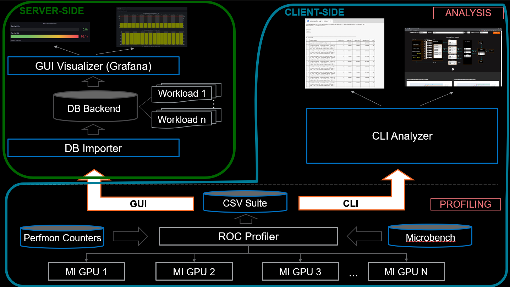

# High Level Design

```eval_rst
.. toctree::
   :glob:
   :maxdepth: 4
```

The [Omniperf](https://github.com/ROCm/omniperf) Tool is architecturally composed of three major components, as shown in the following figure.

- **Omniperf Profiling**: Acquire raw performance counters via application replay based on the [rocProfiler](https://rocm.docs.amd.com/projects/rocprofiler/en/latest/rocprof.html).  The counters are stored in a comma-seperated value, for further analyis. A set of MI200 specific micro benchmarks are also run to acquire the hierarchical roofline data. The roofline model is not available on earlier accelerators.

- **Omniperf Grafana Analyzer**: 
  - *Grafana database import*: All raw performance counters are imported into the backend MongoDB database for Grafana GUI analysis and visualization. Compatibility of previously generated data between Omniperf versions is not necessarily guarenteed.
  - *Grafana GUI Analyzer*: A Grafana dashboard is designed to retrieve the raw counters info from the backend database. It also creates the relevant performance metrics and visualization.
- **Omniperf Standalone GUI Analyzer**: A standalone GUI is provided to enable performance analysis without importing data into the backend database.



> Note: To learn more about the client vs. server model of Omniperf and our install process please see the [Deployment section](./installation.md) of the docs.

