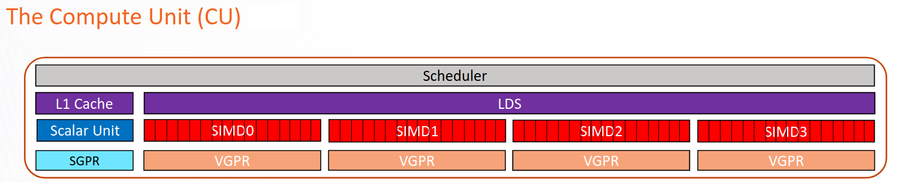

.. meta::
   :description: Omniperf documentation and reference
   :keywords: Omniperf, ROCm, performance, model, profiler, tool, Instinct, accelerator, AMD

*****************
Performance model
*****************

Omniperf makes available an extensive list of metrics to better understand achieved application performance on AMD
Instinct™ MI accelerators including Graphics Core Next (GCN) GPUs like the AMD Instinct MI50, CDNA
accelerators like the MI100, and CDNA2 accelerators such as the MI250X, MI250, and MI210.

To best use profiling data, it's important to understand the role of various hardware blocks of AMD Instinct
accelerators. This section describes each hardware block on the accelerator as interacted with by a software
developer to give a deeper understanding of the metrics reported profiling data. Refer to
:doc:`Profiling with Omniperf by example <how-to/profiling>` for more practical examples and details on how to use
Omniperf to optimize your code.

.. note::

    In this guide, **MI2XX** refers to any of the CDNA2 architecture-based AMD Instinct MI250X, MI250, and MI210
    accelerators interchangeably in cases where the exact product at hand is not vital.

    For a comparison of AMD Instinct accelerator specifications, refer to
    :doc:`Hardware specifications <rocm:reference/gpu-arch-specs>`. For product details, see the
    `MI250X <https://www.amd.com/en/products/accelerators/instinct/mi200/mi250x>`_,
    `MI250 <https://www.amd.com/en/products/accelerators/instinct/mi200/mi250>`_, and
    `MI210 <https://www.amd.com/en/products/accelerators/instinct/mi200/mi210>`_ product pages.

Compute unit
============

The compute unit (CU) is responsible for executing a user's kernels on CDNA-based accelerators. All :ref:`wavefronts`
of a :ref:`workgroup` are scheduled on the same CU.

The CU consists of several independent pipelines and functional units.

For a more in-depth description of a compute unit on a CDNA accelerator, see slides 22 to 28 in
`An introduction to AMD GPU Programming with HIP <https://www.olcf.ornl.gov/wp-content/uploads/2019/09/AMD_GPU_HIP_training_20190906.pdf>`_
and slide 27 in
`The AMD GCN Architecture - A Crash Course (Layla Mah) <https://www.slideshare.net/DevCentralAMD/gs4106-the-amd-gcn-architecture-a-crash-course-by-layla-mah>`_.

Pipeline descriptions
=====================

Vector arithmetic logic unit (VALU)
-----------------------------------

Scalar arithmetic logic unit (SALU)
-----------------------------------

Local data share (LDS)
----------------------

Branch
------

Scheduler
---------

Matrix fused multiply-add (MFMA)
--------------------------------

Pipeline metrics
================

Wavefront
---------

Wavefront runtime stats
^^^^^^^^^^^^^^^^^^^^^^^

Instruction mix
---------------

Overall instruction mix
^^^^^^^^^^^^^^^^^^^^^^^

VALU instruction mix
^^^^^^^^^^^^^^^^^^^^

VMEM instruction mix
^^^^^^^^^^^^^^^^^^^^
