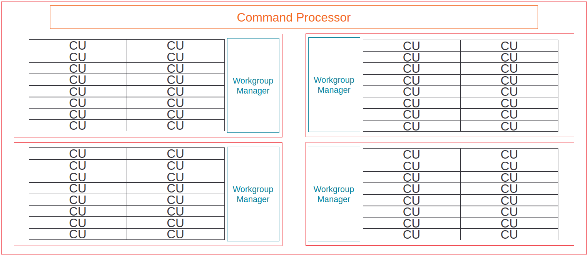

.. meta::
   :description: ROCm Compute Profiler performance model: Shader engine (SE)
   :keywords: ROCm Compute Profiler, ROCm, profiler, tool, Instinct, accelerator, shader, engine, sL1D, L1I, workgroup manager, SPI

******************
Shader engine (SE)
******************

The :doc:`compute units <compute-unit>` on a CDNA™ accelerator are grouped
together into a higher-level organizational unit called a shader engine (SE):

   Example of CU-grouping into shader engines on AMD Instinct MI-series
   accelerators.

The number of CUs on a SE varies from chip to chip -- see for example
:hip-training-pdf:`20`. In addition, newer accelerators such as the AMD
Instinct™ MI 250X have 8 SEs per accelerator.

For the purposes of ROCm Compute Profiler, we consider resources that are shared between
multiple CUs on a single SE as part of the SE's metrics.

These include:

* The :ref:`scalar L1 data cache <desc-sl1d>`

* The :ref:`L1 instruction cache <desc-l1i>`

* The :ref:`workgroup manager <desc-spi>`

.. _desc-sl1d:

Scalar L1 data cache (sL1D)
===========================

The Scalar L1 Data cache (sL1D) can cache data accessed from scalar load
instructions (and scalar store instructions on architectures where they exist)
from wavefronts in the :doc:`CUs <compute-unit>`. The sL1D is shared between
multiple CUs (:gcn-crash-course:`36`) -- the exact number of CUs depends on the
architecture in question (3 CUs in GCN™ GPUs and MI100, 2 CUs in
:ref:`MI2XX <mixxx-note>`) -- and is backed by the :doc:`L2 cache <l2-cache>`.

In typical usage, the data in the sL1D is comprised of:

* Kernel arguments, such as pointers,
  `non-populated <https://llvm.org/docs/AMDGPUUsage.html#amdgpu-amdhsa-sgpr-register-set-up-order-table>`_
  grid and block dimensions, and others

* HIP's ``__constant__`` memory, when accessed in a provably uniform manner
  [#uniform-access]_

* Other memory, when accessed in a provably uniform manner, *and* the backing
  memory is provably constant [#uniform-access]_

.. _desc-sl1d-sol:

Scalar L1D Speed-of-Light
-------------------------

.. warning::

   The theoretical maximum throughput for some metrics in this section are
   currently computed with the maximum achievable clock frequency, as reported
   by ``rocminfo``, for an accelerator. This may not be realistic for all
   workloads.

The Scalar L1D speed-of-light chart shows some key metrics of the sL1D
cache as a comparison with the peak achievable values of those metrics:

.. list-table::
   :header-rows: 1
   :widths: 20 65 15

   * - Metric

     - Description

     - Unit

   * - Bandwidth

     - The number of bytes looked up in the sL1D cache, as a percent of the peak
       theoretical bandwidth. Calculated as the ratio of sL1D requests over the
       :ref:`total sL1D cycles <total-sl1d-cycles>`.

     - Percent

   * - Cache Hit Rate

     - The percent of sL1D requests that hit [#sl1d-cache]_ on a previously
       loaded line in the cache. Calculated as the ratio of the number of sL1D
       requests that hit over the number of all sL1D requests.

     - Percent

   * - sL1D-L2 BW

     - The number of bytes requested by the sL1D from the L2 cache, as a percent
       of the peak theoretical sL1D → L2 cache bandwidth.  Calculated as the
       ratio of the total number of requests from the sL1D to the L2 cache over
       the :ref:`total sL1D-L2 interface cycles <total-sl1d-cycles>`.

     - Percent

.. _desc-sl1d-stats:

Scalar L1D cache accesses
-------------------------

This panel gives more detail on the types of accesses made to the sL1D,
and the hit/miss statistics.

.. list-table::
   :header-rows: 1

   * - Metric

     - Description

     - Unit

   * - Requests

     - The total number of requests, of any size or type, made to the sL1D per
       :ref:`normalization unit <normalization-units>`.

     - Requests per :ref:`normalization unit <normalization-units>`

   * - Hits

     - The total number of sL1D requests that hit on a previously loaded cache
       line, per :ref:`normalization unit <normalization-units>`.

     - Requests per :ref:`normalization unit <normalization-units>`

   * - Misses - Non Duplicated

     - The total number of sL1D requests that missed on a cache line that *was
       not* already pending due to another request, per
       :ref:`normalization unit <normalization-units>`. See :ref:`desc-sl1d-sol`
       for more detail.

     - Requests per :ref:`normalization unit <normalization-units>`

   * - Misses - Duplicated

     - The total number of sL1D requests that missed on a cache line that *was*
       already pending due to another request, per
       :ref:`normalization unit <normalization-units>`. See
       :ref:`desc-sl1d-sol` for more detail.

     - Requests per :ref:`normalization unit <normalization-units>`

   * - Cache Hit Rate

     - Indicates the percent of sL1D requests that hit on a previously loaded
       line the cache. The ratio of the number of sL1D requests that hit
       [#sl1d-cache]_ over the number of all sL1D requests.

     - Percent

   * - Read Requests (Total)

     - The total number of sL1D read requests of any size, per
       :ref:`normalization unit <normalization-units>`.

     - Requests per :ref:`normalization unit <normalization-units>`

   * - Atomic Requests

     - The total number of sL1D atomic requests of any size, per
       :ref:`normalization unit <normalization-units>`. Typically unused on CDNA
       accelerators.

     - Requests per :ref:`normalization unit <normalization-units>`

   * - Read Requests (1 DWord)

     - The total number of sL1D read requests made for a single dword of data
       (4B), per :ref:`normalization unit <normalization-units>`.

     - Requests per :ref:`normalization unit <normalization-units>`

   * - Read Requests (2 DWord)

     - The total number of sL1D read requests made for a two dwords of data
       (8B), per :ref:`normalization unit <normalization-units>`.

     - Requests per :ref:`normalization unit <normalization-units>`

   * - Read Requests (4 DWord)

     - The total number of sL1D read requests made for a four dwords of data
       (16B), per :ref:`normalization unit <normalization-units>`.

     - Requests per :ref:`normalization unit <normalization-units>`

   * - Read Requests (8 DWord)

     - The total number of sL1D read requests made for a eight dwords of data
       (32B), per :ref:`normalization unit <normalization-units>`.

     - Requests per :ref:`normalization unit <normalization-units>`

   * - Read Requests (16 DWord)

     - The total number of sL1D read requests made for a sixteen dwords of data
       (64B), per :ref:`normalization unit <normalization-units>`.

     - Requests per :ref:`normalization unit <normalization-units>`

.. _desc-sl1d-l2-interface:

sL1D ↔ L2 Interface
-------------------

This panel gives more detail on the data requested across the
sL1D↔
:doc:`L2 <l2-cache>` interface.

.. list-table::
   :header-rows: 1

   * - Metric

     - Description

     - Unit

   * - sL1D-L2 BW

     - The total number of bytes read from, written to, or atomically updated
       across the sL1D↔:doc:`L2 <l2-cache>` interface, per
       :ref:`normalization unit <normalization-units>`. Note that sL1D writes
       and atomics are typically unused on current CDNA accelerators, so in the
       majority of cases this can be interpreted as an sL1D→L2 read bandwidth.

     - Bytes per :ref:`normalization unit <normalization-units>`

   * - Read Requests

     - The total number of read requests from sL1D to the :doc:`L2 <l2-cache>`,
       per :ref:`normalization unit <normalization-units>`.

     - Requests per :ref:`normalization unit <normalization-units>`

   * - Write Requests

     - The total number of write requests from sL1D to the :doc:`L2 <l2-cache>`,
       per :ref:`normalization unit <normalization-units>`. Typically unused on
       current CDNA accelerators.

     - Requests per :ref:`normalization unit <normalization-units>`

   * - Atomic Requests

     - The total number of atomic requests from sL1D to the
       :doc:`L2 <l2-cache>`, per
       :ref:`normalization unit <normalization-units>`. Typically unused on
       current CDNA accelerators.

     - Requests per :ref:`normalization unit <normalization-units>`

   * - Stall Cycles

     - The total number of cycles the sL1D↔
       :doc:`L2 <l2-cache>` interface was stalled, per
       :ref:`normalization unit <normalization-units>`.

     - Cycles per :ref:`normalization unit <normalization-units>`

.. rubric:: Footnotes

.. [#uniform-access] The scalar data cache is used when the compiler emits
   scalar loads to access data. This requires that the data be *provably*
   uniformly accesses (that is, the compiler can verify that all work-items in a
   wavefront access the same data), *and* that the data can be proven to be
   read-only (for instance, HIP's ``__constant__`` memory, or properly
   ``__restrict__``\ed pointers to avoid write-aliasing). Access of
   ``__constant__`` memory for example is not guaranteed to go through the sL1D
   if the wavefront loads a non-uniform value.

.. [#sl1d-cache] Unlike the :doc:`vL1D <vector-l1-cache>` and
   :doc:`L2 <l2-cache>` caches, the sL1D cache on AMD Instinct MI-series CDNA
   accelerators does *not* use the "hit-on-miss" approach to reporting cache
   hits. That is, if while satisfying a miss, another request comes in that
   would hit on the same pending cache line, the subsequent request will be
   counted as a *duplicated miss*.

.. _desc-l1i:

L1 Instruction Cache (L1I)
==========================

As with the :ref:`sL1D <desc-sL1D>`, the L1 Instruction (L1I) cache is shared
between multiple CUs on a shader-engine, where the precise number of CUs
sharing a L1I depends on the architecture in question (:gcn-crash-course:`36`)
and is backed by the :doc:`L2 cache <l2-cache>`. Unlike the sL1D, the
instruction cache is read-only.

.. _desc-l1i-sol:

L1I Speed-of-Light
------------------

.. warning::

   The theoretical maximum throughput for some metrics in this section are
   currently computed with the maximum achievable clock frequency, as reported
   by ``rocminfo``, for an accelerator. This may not be realistic for all
   workloads.

The L1 Instruction Cache speed-of-light chart shows some key metrics of
the L1I cache as a comparison with the peak achievable values of those
metrics:

.. list-table::
   :header-rows: 1

   * - Metric

     - Description

     - Unit

   * - Bandwidth

     - The number of bytes looked up in the L1I cache, as a percent of the peak
       theoretical bandwidth. Calculated as the ratio of L1I requests over the
       :ref:`total L1I cycles <total-l1i-cycles>`.

     - Percent

   * - Cache Hit Rate

     - The percent of L1I requests that hit on a previously loaded line the
       cache. Calculated as the ratio of the number of L1I requests that hit
       [#l1i-cache]_ over the number of all L1I requests.

     - Percent

   * - L1I-L2 BW

     - The percent of the peak theoretical L1I → L2 cache request bandwidth
       achieved. Calculated as the ratio of the total number of requests from
       the L1I to the L2 cache over the
       :ref:`total L1I-L2 interface cycles <total-l1i-cycles>`.

     - Percent

   * - Instruction Fetch Latency

     - The average number of cycles spent to fetch instructions to a
       :doc:`CU <compute-unit>`.

     - Cycles

.. _desc-l1i-stats:

L1I cache accesses
------------------

This panel gives more detail on the hit/miss statistics of the L1I:

.. list-table::
   :header-rows: 1

   * - Metric

     - Description

     - Unit

   * - Requests

     - The total number of requests made to the L1I per
       :ref:`normalization-unit <normalization-units>`.

     - Requests per :ref:`normalization unit <normalization-units>`.

   * - Hits

     - The total number of L1I requests that hit on a previously loaded cache
       line, per :ref:`normalization-unit <normalization-units>`.

     - Requests per :ref:`normalization unit <normalization-units>`

   * - Misses - Non Duplicated

     - The total number of L1I requests that missed on a cache line that
       *were not* already pending due to another request, per
       :ref:`normalization-unit <normalization-units>`. See note in
       :ref:`desc-l1i-sol` for more detail.

     - Requests per :ref:`normalization unit <normalization-units>`.

   * - Misses - Duplicated

     - The total number of L1I requests that missed on a cache line that *were*
       already pending due to another request, per
       :ref:`normalization-unit <normalization-units>`. See note in
       :ref:`desc-l1i-sol` for more detail.

     - Requests per :ref:`normalization unit <normalization-units>`

   * - Cache Hit Rate

     - The percent of L1I requests that hit [#l1i-cache]_ on a previously loaded
       line the cache. Calculated as the ratio of the number of L1I requests
       that hit over the number of all L1I requests.

     - Percent

L1I - L2 interface
------------------

This panel gives more detail on the data requested across the
L1I-:doc:`L2 <l2-cache>` interface.

.. list-table::
   :header-rows: 1

   * - Metric

     - Description

     - Unit

   * - L1I-L2 BW

     - The total number of bytes read across the L1I-:doc:`L2 <l2-cache>`
       interface, per :ref:`normalization unit <normalization-units>`.

     - Bytes per :ref:`normalization unit <normalization-units>`

.. rubric:: Footnotes

.. [#l1i-cache] Unlike the :doc:`vL1D <vector-l1-cache>` and
   :doc:`L2 <l2-cache>` caches, the L1I cache on AMD Instinct MI-series CDNA
   accelerators does *not* use the "hit-on-miss" approach to reporting cache
   hits. That is, if while satisfying a miss, another request comes in that
   would hit on the same pending cache line, the subsequent request will be
   counted as a *duplicated miss*.

.. _desc-spi:

Workgroup manager (SPI)
=======================

The workgroup manager (SPI) is the bridge between the
:doc:`command processor <command-processor>` and the
:doc:`compute units <compute-unit>`. After the command processor processes a
kernel dispatch, it will then pass the dispatch off to the workgroup manager,
which then schedules :ref:`workgroups <desc-workgroup>` onto the compute units.
As workgroups complete execution and resources become available, the
workgroup manager will schedule new workgroups onto compute units. The workgroup
manager’s metrics therefore are focused on reporting the following:

*  Utilizations of various parts of the accelerator that the workgroup
   manager interacts with (and the workgroup manager itself)

*  How many workgroups were dispatched, their size, and how many
   resources they used

*  Percent of scheduler opportunities (cycles) where workgroups failed
   to dispatch, and

*  Percent of scheduler opportunities (cycles) where workgroups failed
   to dispatch due to lack of a specific resource on the CUs (for instance, too
   many VGPRs allocated)

This gives you an idea of why the workgroup manager couldn’t schedule more
wavefronts onto the device, and is most useful for workloads that you suspect to
be limited by scheduling or launch rate.

As discussed in :doc:`Command processor <command-processor>`, the command
processor on AMD Instinct MI-series architectures contains four hardware
scheduler-pipes, each with eight software threads (:mantor-vega10-pdf:`19`). Each
scheduler-pipe can issue a kernel dispatch to the workgroup manager to schedule
concurrently. Therefore, some workgroup manager metrics are presented relative
to the utilization of these scheduler-pipes (for instance, whether all four are
issuing concurrently).

.. note::

   Current versions of the profiling libraries underlying ROCm Compute Profiler attempt to
   serialize concurrent kernels running on the accelerator, as the performance
   counters on the device are global (that is, shared between concurrent
   kernels). This means that these scheduler-pipe utilization metrics are
   expected to reach (for example) a maximum of one pipe active -- only 25%.

Workgroup manager utilizations
------------------------------

This section describes the utilization of the workgroup manager, and the
hardware components it interacts with.

.. list-table::
   :header-rows: 1
   :widths: 20 65 15

   * - Metric

     - Description

     - Unit

   * - Accelerator utilization

     - The percent of cycles in the kernel where the accelerator was actively
       doing any work.

     - Percent

   * - Scheduler-pipe utilization

     - The percent of :ref:`total scheduler-pipe cycles <total-pipe-cycles>` in
       the kernel where the scheduler-pipes were actively doing any work. Note:
       this value is expected to range between 0% and 25%. See :ref:`desc-spi`.

     - Percent

   * - Workgroup manager utilization

     - The percent of cycles in the kernel where the workgroup manager was
       actively doing any work.

     - Percent

   * - Shader engine utilization

     - The percent of :ref:`total shader engine cycles <total-se-cycles>` in the
       kernel where any CU in a shader-engine was actively doing any work,
       normalized over all shader-engines. Low values (e.g., << 100%) indicate
       that the accelerator was not fully saturated by the kernel, or a
       potential load-imbalance issue.

     - Percent

   * - SIMD utilization

     - The percent of :ref:`total SIMD cycles <total-simd-cycles>` in the kernel
       where any :ref:`SIMD <desc-valu>` on a CU was actively doing any work,
       summed over all CUs. Low values (less than 100%) indicate that the
       accelerator was not fully saturated by the kernel, or a potential
       load-imbalance issue.

     - Percent

   * - Dispatched workgroups

     - The total number of workgroups forming this kernel launch.

     - Workgroups

   * - Dispatched wavefronts

     - The total number of wavefronts, summed over all workgroups, forming this
       kernel launch.

     - Wavefronts

   * - VGPR writes

     - The average number of cycles spent initializing :ref:`VGPRs <desc-valu>`
       at wave creation.

     - Cycles/wave

   * - SGPR Writes

     - The average number of cycles spent initializing :ref:`SGPRs <desc-salu>`
       at wave creation.

     - Cycles/wave

Resource allocation
-------------------

This panel gives more detail on how workgroups and wavefronts were scheduled
onto compute units, and what occupancy limiters they hit -- if any. When
analyzing these metrics, you should also take into account their
achieved occupancy -- such as
:ref:`wavefront occupancy <wavefront-runtime-stats>`. A kernel may be occupancy
limited by LDS usage, for example, but may still achieve high occupancy levels
such that improving occupancy further may not improve performance. See
:ref:`occupancy-example` for details.

.. list-table::
   :header-rows: 1

   * - Metric

     - Description

     - Unit

   * - Not-scheduled rate (Workgroup Manager)

     - The percent of :ref:`total scheduler-pipe cycles <total-pipe-cycles>` in
       the kernel where a workgroup could not be scheduled to a
       :doc:`CU <compute-unit>` due to a bottleneck within the workgroup manager
       rather than a lack of a CU or :ref:`SIMD <desc-valu>` with sufficient
       resources. Note: this value is expected to range between 0-25%. See note
       in :ref:`workgroup manager <desc-spi>` description.

     - Percent

   * - Not-scheduled rate (Scheduler-Pipe)

     - The percent of :ref:`total scheduler-pipe cycles <total-pipe-cycles>` in
       the kernel where a workgroup could not be scheduled to a
       :doc:`CU <compute-unit>` due to a bottleneck within the scheduler-pipes
       rather than a lack of a CU or :ref:`SIMD <desc-valu>` with sufficient
       resources. Note: this value is expected to range between 0-25%, see note
       in :ref:`workgroup manager <desc-spi>` description.

     - Percent

   * - Scheduler-Pipe Stall Rate

     - The percent of :ref:`total scheduler-pipe cycles <total-pipe-cycles>` in
       the kernel where a workgroup could not be scheduled to a
       :doc:`CU <compute-unit>` due to occupancy limitations (like a lack of a
       CU or :ref:`SIMD <desc-valu>` with sufficient resources). Note: this
       value is expected to range between 0-25%, see note in
       :ref:`workgroup manager <desc-spi>` description.

     - Percent

   * - Scratch Stall Rate

     - The percent of :ref:`total shader-engine cycles <total-se-cycles>` in the
       kernel where a workgroup could not be scheduled to a
       :doc:`CU <compute-unit>` due to lack of
       :ref:`private (a.k.a., scratch) memory <memory-type>` slots. While this
       can reach up to 100%, note that the actual occupancy limitations on a
       kernel using private memory are typically quite small (for example, less
       than 1% of the total number of waves that can be scheduled to an
       accelerator).

     - Percent

   * - Insufficient SIMD Waveslots

     - The percent of :ref:`total SIMD cycles <total-simd-cycles>` in the kernel
       where a workgroup could not be scheduled to a  :ref:`SIMD <desc-valu>`
       due to lack of available :ref:`waveslots <desc-valu>`.

     - Percent

   * - Insufficient SIMD VGPRs

     - The percent of :ref:`total SIMD cycles <total-simd-cycles>` in the kernel
       where a workgroup could not be scheduled to a  :ref:`SIMD <desc-valu>`
       due to lack of available :ref:`VGPRs <desc-valu>`.

     - Percent

   * - Insufficient SIMD SGPRs

     - The percent of :ref:`total SIMD cycles <total-simd-cycles>` in the kernel
       where a workgroup could not be scheduled to a :ref:`SIMD <desc-valu>`
       due to lack of available :ref:`SGPRs <desc-salu>`.

     - Percent

   * - Insufficient CU LDS

     - The percent of :ref:`total CU cycles <total-cu-cycles>` in the kernel
       where a workgroup could not be scheduled to a :doc:`CU <compute-unit>`
       due to lack of available :doc:`LDS <local-data-share>`.

     - Percent

   * - Insufficient CU Barriers

     - The percent of :ref:`total CU cycles <total-cu-cycles>` in the kernel
       where a workgroup could not be scheduled to a :doc:`CU <compute-unit>`
       due to lack of available :ref:`barriers <desc-barrier>`.

     - Percent

   * - Reached CU Workgroup Limit

     - The percent of :ref:`total CU cycles <total-cu-cycles>` in the kernel
       where a workgroup could not be scheduled to a :doc:`CU <compute-unit>`
       due to limits within the workgroup manager.  This is expected to be
       always be zero on CDNA2 or newer accelerators (and small for previous
       accelerators).

     - Percent

   * - Reached CU Wavefront Limit

     - The percent of :ref:`total CU cycles <total-cu-cycles>` in the kernel
       where a wavefront could not be scheduled to a :doc:`CU <compute-unit>`
       due to limits within the workgroup manager.  This is expected to be
       always be zero on CDNA2 or newer accelerators (and small for previous
       accelerators).

     - Percent

