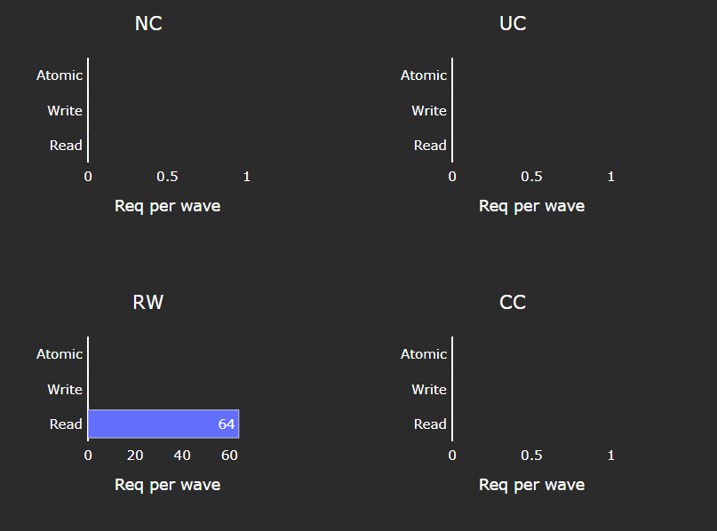

********************
Grafana GUI analysis
********************

Find setup instructions in :doc:`../../install/grafana-setup`.

The Omniperf Grafana analysis dashboard GUI supports the following features to
facilitate MI accelerator performance profiling and analysis:

* System and Hardware Component (Hardware Block)

* :ref:`Speed-of-Light <analysis-sol>` (SOL)

* :ref:`Multiple normalization options <analysis-normalizations>`
  
* Baseline comparisons

* :ref:`Regex-based dispatch ID filtering <analysis-regex-dispatch-id>`

* Roofline Analysis

* Detailed performance counters and metrics per hardware component, such as:

  * Command Processor - Fetch (CPF) / Command Processor - Controller (CPC)

  * Workgroup Manager (SPI)

  * Shader Sequencer (SQ)

  * Shader Sequencer Controller (SQC)

  * L1 Address Processing Unit, a.k.a. Texture Addresser (TA) / L1 Backend Data
    Processing Unit, a.k.a. Texture Data (TD)

  * L1 Cache (TCP)

  * L2 Cache (TCC) (both aggregated and per-channel perf info)

.. _analysis-sol:

Speed-of-Light
--------------

Speed-of-Light panels are provided at both the system and per hardware component
level to help diagnosis performance bottlenecks. The performance numbers of the
workload under testing are compared to the theoretical maximum, (e.g. floating
point operations, bandwidth, cache hit rate, etc.), to indicate the available
room to further utilize the hardware capability.

.. _analysis-normalizations:

Normalizations
--------------

Multiple performance number normalizations are provided to allow performance
inspection within both hardware and software context. The following
normalizations are available.

* ``per_wave``

* ``per_cycle``

* ``per_kernel``

* ``per_second``

See :ref:`normalization-units` to learn more about Omniperf normalizations.

.. _analysis-baseline-comparison:

Baseline comparison
-------------------

Omniperf enables baseline comparison to allow checking A/B effect. Currently
baseline comparison is limited to the same SoC. Cross comparison between SoCs is
in development.

For both the Current Workload and the Baseline Workload, one can independently
setup the following filters to allow fine grained comparisons:

* Workload Name

* GPU ID filtering (multi-selection)

* Kernel Name filtering (multi-selection)

* Dispatch ID filtering (regex filtering)

* Omniperf Panels (multi-selection)

.. _analysis-regex-dispatch-id:

Regex-based dispatch ID filtering
---------------------------------

Omniperf allows filtering via Regular Expressions (regex), a standard Linux
string matching syntax, based dispatch ID filtering to flexibly choose the
kernel invocations.

For example, to inspect Dispatch Range from 17 to 48, inclusive, the
corresponding regex is : ``(1[7-9]|[23]\d|4[0-8])``.

.. tip::

   Try `Regex Numeric Range Generator <https://3widgets.com/>`_ for help
   generating typical number ranges.

.. _analysis-incremental-profiling:

Incremental profiling
---------------------

Omniperf supports incremental profiling to speed up performance analysis.

Refer to the :ref:`profiling-hw-component-filtering` section for this command.

By default, the entire application is profiled to collect performance counters
for all hardware blocks, giving a complete view of where the workload stands in
terms of performance optimization opportunities and bottlenecks.

You can choose to focus on only a few hardware components -- for example L1
cache or LDS -- to closely check the effect of software optimizations, without
performing application replay for *all* other hardware components. This saves
a lot of compute time. In addition, prior profiling results for other hardware
components are not overwritten; instead, they can be merged during the import to
piece together an overall profile of the system.

.. _analysis-color-coding:

Color coding
------------

Uniform color coding applies to most visualizations -- including bar graphs,
tables, and diagrams -- for easy inspection. As a rule of thumb, *yellow* means
over 50%, while *red* means over 90% percent.

Global variables and configurations
-----------------------------------

.. image:: ../../data/analyze/global_variables.png
   :align: center

.. _grafana-gui-import:

Grafana GUI import
------------------

The Omniperf database ``--import`` option imports the raw profiling data to
Grafana's backend MongoDB database. This step is only required for Grafana
GUI-based performance analysis.

Default username and password for MongoDB (to be used in database mode) are as
follows:

* **Username**: ``temp``

* **Password**: ``temp123``

Each workload is imported to a separate database with the following naming
convention:

.. code-block:: shell

    ``omniperf_<team>_<database>_<soc>``

For example:

.. code-block:: shell

   ``omniperf_asw_vcopy_mi200``.

When using :ref:`database mode <modes-database>`, be sure to tailor the
connection options to the machine hosting your
:doc:`server-side instance </install/grafana-setup>`. Below is the sample
command to import the *vcopy* profiling data, assuming our host machine is
called ``dummybox``.

.. _grafana-gui-remove:

.. code-block:: shell-session

   $ omniperf database --help
   usage:

   omniperf database <interaction type> [connection options]

   -------------------------------------------------------------------------------

   Examples:

           omniperf database --import -H pavii1 -u temp -t asw -w workloads/vcopy/mi200/

           omniperf database --remove -H pavii1 -u temp -w omniperf_asw_sample_mi200

   -------------------------------------------------------------------------------

   Help:
     -h, --help         show this help message and exit

   General Options:
     -v, --version      show program's version number and exit
     -V, --verbose      Increase output verbosity (use multiple times for higher levels)
     -s, --specs        Print system specs.

   Interaction Type:
     -i, --import                                  Import workload to Omniperf DB
     -r, --remove                                  Remove a workload from Omniperf DB

   Connection Options:
     -H , --host                                   Name or IP address of the server host.
     -P , --port                                   TCP/IP Port. (DEFAULT: 27018)
     -u , --username                               Username for authentication.
     -p , --password                               The user's password. (will be requested later if it's not set)
     -t , --team                                   Specify Team prefix.
     -w , --workload                               Specify name of workload (to remove) or path to workload (to import)
     --kernel-verbose              Specify Kernel Name verbose level 1-5. Lower the level, shorter the kernel name. (DEFAULT: 5) (DISABLE: 5)

Omniperf import for vcopy:
^^^^^^^^^^^^^^^^^^^^^^^^^^

.. code-block:: shell

   $ omniperf database --import -H dummybox -u temp -t asw -w workloads/vcopy/mi200/

     ___                  _                  __ 
    / _ \ _ __ ___  _ __ (_)_ __   ___ _ __ / _|
   | | | | '_ ` _ \| '_ \| | '_ \ / _ \ '__| |_ 
   | |_| | | | | | | | | | | |_) |  __/ |  |  _|
    \___/|_| |_| |_|_| |_|_| .__/ \___|_|  |_|  
                           |_|                  

    
   Pulling data from  /home/auser/repos/omniperf/sample/workloads/vcopy/MI200
   The directory exists
   Found sysinfo file
   KernelName shortening enabled
   Kernel name verbose level: 2
   Password:
   Password received
   -- Conversion & Upload in Progress --
     0%|                                                                                                                                                                                                             | 0/11 [00:00<?, ?it/s]/home/auser/repos/omniperf/sample/workloads/vcopy/MI200/SQ_IFETCH_LEVEL.csv
     9%|█████████████████▉                                                                                                                                                                                   | 1/11 [00:00<00:01,  8.53it/s]/home/auser/repos/omniperf/sample/workloads/vcopy/MI200/pmc_perf.csv
    18%|███████████████████████████████████▊                                                                                                                                                                 | 2/11 [00:00<00:01,  6.99it/s]/home/auser/repos/omniperf/sample/workloads/vcopy/MI200/SQ_INST_LEVEL_SMEM.csv
    27%|█████████████████████████████████████████████████████▋                                                                                                                                               | 3/11 [00:00<00:01,  7.90it/s]/home/auser/repos/omniperf/sample/workloads/vcopy/MI200/SQ_LEVEL_WAVES.csv
    36%|███████████████████████████████████████████████████████████████████████▋                                                                                                                             | 4/11 [00:00<00:00,  8.56it/s]/home/auser/repos/omniperf/sample/workloads/vcopy/MI200/SQ_INST_LEVEL_LDS.csv
    45%|█████████████████████████████████████████████████████████████████████████████████████████▌                                                                                                           | 5/11 [00:00<00:00,  9.00it/s]/home/auser/repos/omniperf/sample/workloads/vcopy/MI200/SQ_INST_LEVEL_VMEM.csv
    55%|███████████████████████████████████████████████████████████████████████████████████████████████████████████▍                                                                                         | 6/11 [00:00<00:00,  9.24it/s]/home/auser/repos/omniperf/sample/workloads/vcopy/MI200/sysinfo.csv
    64%|█████████████████████████████████████████████████████████████████████████████████████████████████████████████████████████████▎                                                                       | 7/11 [00:00<00:00,  9.37it/s]/home/auser/repos/omniperf/sample/workloads/vcopy/MI200/roofline.csv
    82%|█████████████████████████████████████████████████████████████████████████████████████████████████████████████████████████████████████████████████████████████████▏                                   | 9/11 [00:00<00:00, 12.60it/s]/home/auser/repos/omniperf/sample/workloads/vcopy/MI200/timestamps.csv
   100%|████████████████████████████████████████████████████████████████████████████████████████████████████████████████████████████████████████████████████████████████████████████████████████████████████| 11/11 [00:00<00:00, 11.05it/s]
   9 collections added.
   Workload name uploaded
   -- Complete! --

.. _panels:

Omniperf panels
---------------

There are currently 18 main panel categories available for analyzing the compute
workload performance. Each category contains several panels for close inspection
of the system performance.

- Kernel Statistics

  - Kernel time histogram

  - Top Ten bottleneck kernels

- System Speed-of-Light

  - Speed-of-Light

  - System Info table

- Memory Chart Analysis

- Roofline Analysis

  - FP32/FP64

  - FP16/INT8

- Command Processor

  - Command Processor - Fetch (CPF)

  - Command Processor - Controller (CPC)

- Workgroup Manager or Shader Processor Input (SPI)

  - SPI Stats

  - SPI Resource Allocations

- Wavefront Launch

  - Wavefront Launch Stats

  - Wavefront runtime stats

  - per-SE Wavefront Scheduling performance

- Wavefront Lifetime

  - Wavefront lifetime breakdown

  - per-SE wavefront life (average)

  - per-SE wavefront life (histogram)

- Wavefront Occupancy

  - per-SE wavefront occupancy

  - per-CU wavefront occupancy

- Compute Unit - Instruction Mix

  - per-wave Instruction mix

  - per-wave VALU Arithmetic instruction mix

  - per-wave MFMA Arithmetic instruction mix

- Compute Unit - Compute Pipeline

  - Speed-of-Light: Compute Pipeline

  - Arithmetic OPs count

  - Compute pipeline stats

  - Memory latencies

- Local Data Share (LDS)

  - Speed-of-Light: LDS

  - LDS stats

- Instruction Cache

  - Speed-of-Light: Instruction Cache

  - Instruction Cache Accesses

- Constant Cache

  - Speed-of-Light: Constant Cache

  - Constant Cache Accesses

  - Constant Cache - L2 Interface stats

- Texture Address and Texture Data

  - Texture Address (TA)

  - Texture Data (TD)

- L1 Cache

  - Speed-of-Light: L1 Cache

  - L1 Cache Accesses

  - L1 Cache Stalls

  - L1 - L2 Transactions

  - L1 - UTCL1 Interface stats

- L2 Cache

  - Speed-of-Light: L2 Cache

  - L2 Cache Accesses

  - L2 - EA Transactions

  - L2 - EA Stalls

- L2 Cache Per Channel Performance

  - Per-channel L2 Hit rate

  - Per-channel L1-L2 Read requests

  - Per-channel L1-L2 Write Requests

  - Per-channel L1-L2 Atomic Requests

  - Per-channel L2-EA Read requests

  - Per-channel L2-EA Write requests

  - Per-channel L2-EA Atomic requests

  - Per-channel L2-EA Read latency

  - Per-channel L2-EA Write latency

  - Per-channel L2-EA Atomic latency

  - Per-channel L2-EA Read stall (I/O, GMI, HBM)

  - Per-channel L2-EA Write stall (I/O, GMI, HBM, Starve)

Most panels are designed around a specific hardware component block to
thoroughly understand its behavior. Additional panels, including custom panels,
could also be added to aid the performance analysis.

System Info Panel
^^^^^^^^^^^^^^^^^

   System details logged from the host machine.

Kernel statistics
^^^^^^^^^^^^^^^^^

Kernel time histogram
+++++++++++++++++++++

.. figure:: ../../data/analyze/grafana/Kernel_time_histogram.png
   :align: center
   :alt: Kernel time histogram panel in Omniperf Grafana

   Mapping application kernel launches to execution duration.

Top bottleneck kernels
++++++++++++++++++++++

   Top N kernels and relevant statistics. Sorted by total duration.

Top bottleneck dispatches
+++++++++++++++++++++++++

.. figure:: ../../data/analyze/grafana/Top_bottleneck_dispatches.png
   :align: center
   :alt: Top bottleneck dispatches panel in Omniperf Grafana

   Top N kernel dispatches and relevant statistics. Sorted by total duration.

Current and Baseline Dispatch IDs (Filtered)
++++++++++++++++++++++++++++++++++++++++++++

   List of all kernel dispatches.

System Speed-of-Light
^^^^^^^^^^^^^^^^^^^^^

   Key metrics from various sections of Omniperf’s profiling report.

Memory Chart Analysis
^^^^^^^^^^^^^^^^^^^^^

.. note::

   The Memory Chart Analysis support multiple normalizations. Due to limited
   space, all transactions, when normalized to ``per_sec``, default to unit of
   billion transactions per second.

   A graphical representation of performance data for memory blocks on the GPU.

Empirical Roofline Analysis
^^^^^^^^^^^^^^^^^^^^^^^^^^^

   Visualize achieved performance relative to a benchmarked peak performance.

Command Processor
^^^^^^^^^^^^^^^^^

Command Processor Fetcher
+++++++++++++++++++++++++

   Fetches commands out of memory to hand them over to the Command Processor
   Fetcher (CPC) for processing

Command Processor Compute
+++++++++++++++++++++++++

   The micro-controller running the command processing firmware that decodes the
   fetched commands, and (for kernels) passes them to the Workgroup Managers
   (SPIs) for scheduling.

See :doc:`/conceptual/command-processor` to learn about reported metrics.

Shader Processor Input (SPI)
^^^^^^^^^^^^^^^^^^^^^^^^^^^^

SPI Stats
+++++++++

..
   TODO: Add caption after merge

SPI Resource Allocation
+++++++++++++++++++++++

..
   TODO: Add caption after merge

Wavefront
^^^^^^^^^

Wavefront Launch Stats
++++++++++++++++++++++

   General information about the kernel launch.

Wavefront Runtime Stats
+++++++++++++++++++++++

   High-level overview of the execution of wavefronts in a kernel.

Compute Unit - Instruction Mix
^^^^^^^^^^^^^^^^^^^^^^^^^^^^^^

Instruction Mix
+++++++++++++++

   Breakdown of the various types of instructions executed by the user’s kernel,
   and which pipelines on the Compute Unit (CU) they were executed on.

VALU Arithmetic Instruction Mix
+++++++++++++++++++++++++++++++

   The various types of vector instructions that were issued to the vector
   arithmetic logic unit (VALU).

MFMA Arithmetic Instruction Mix
+++++++++++++++++++++++++++++++

   The types of Matrix Fused Multiply-Add (MFMA) instructions that were issued.

VMEM Arithmetic Instruction Mix
+++++++++++++++++++++++++++++++

   The types of vector memory (VMEM) instructions that were issued.

Compute Unit - Compute Pipeline
^^^^^^^^^^^^^^^^^^^^^^^^^^^^^^^

Speed-of-Light
++++++++++++++

   The number of floating-point and integer operations executed on the vector
   arithmetic logic unit (VALU) and Matrix Fused Multiply-Add (MFMA) units in
   various precisions.

Pipeline Stats
++++++++++++++

   More detailed metrics to analyze the several independent pipelines found in
   the Compute Unit (CU).

Arithmetic Operations
+++++++++++++++++++++

   The total number of floating-point and integer operations executed in various
   precisions.

Local Data Share (LDS)
^^^^^^^^^^^^^^^^^^^^^^

Speed-of-Light
++++++++++++++

   Key metrics for the Local Data Share (LDS) as a comparison with the peak
   achievable values of those metrics.

LDS Stats
+++++++++

   More detailed view of the Local Data Share (LDS) performance.

Instruction Cache
^^^^^^^^^^^^^^^^^

Speed-of-Light
++++++++++++++

   Key metrics of the L1 Instruction (L1I) cache as a comparison with the peak
   achievable values of those metrics.

Instruction Cache Stats
+++++++++++++++++++++++

   More detail on the hit/miss statistics of the L1 Instruction (L1I) cache.

Scalar L1D Cache
^^^^^^^^^^^^^^^^

Speed-of-Light
++++++++++++++

   Key metrics of the Scalar L1 Data (sL1D) cache as a comparison with the peak
   achievable values of those metrics.

Scalar L1D Cache Accesses
+++++++++++++++++++++++++

   More detail on the types of accesses made to the Scalar L1 Data (sL1D) cache,
   and the hit/miss statistics.

Scalar L1D Cache - L2 Interface
+++++++++++++++++++++++++++++++

   More detail on the data requested across the Scalar L1 Data (sL1D) cache <->
   L2 interface.

Texture Address and Texture Data
^^^^^^^^^^^^^^^^^^^^^^^^^^^^^^^^

Texture Addresser
+++++++++++++++++

   Metric specific to texture addresser (TA) which receives commands (e.g.,
   instructions) and write/atomic data from the Compute Unit (CU), and coalesces
   them into fewer requests for the cache to process.

Texture Data
++++++++++++

.. figure:: ../../data/analyze/grafana/td_panel.png
   :align: center
   :alt: Texture Data panel in Omniperf Grafana

   Metrics specific to texture data (TD) which routes data back to the
   requesting Compute Unit (CU).

Vector L1 Data Cache
^^^^^^^^^^^^^^^^^^^^

Speed-of-Light
++++++++++++++

   Key metrics of the vector L1 data (vL1D) cache as a comparison with the peak
   achievable values of those metrics.

L1D Cache Stalls
++++++++++++++++

   More detail on where vector L1 data (vL1D) cache is stalled in the pipeline,
   which may indicate performance limiters of the cache.

L1D Cache Accesses
++++++++++++++++++

   The type of requests incoming from the cache front-end, the number of requests
   that were serviced by the vector L1 data (vL1D) cache, and the number & type
   of outgoing requests to the L2 cache.

L1D - L2 Transactions
+++++++++++++++++++++

   A more granular look at the types of requests made to the L2 cache.

L1D Addr Translation
++++++++++++++++++++

   After a vector memory instruction has been processed/coalesced by the address
   processing unit of the vector L1 data (vL1D) cache, it must be translated
   from a virtual to physical address. These metrics provide more details on the
   L1 Translation Lookaside Buffer (TLB) which handles this process.

L2 Cache
^^^^^^^^

Speed-of-Light
++++++++++++++

   Key metrics about the performance of the L2 cache, aggregated over all the
   L2 channels, as a comparison with the peak achievable values of those
   metrics.

L2 Cache Accesses
+++++++++++++++++

   Incoming requests to the L2 cache from the vector L1 data (vL1D) cache and
   other clients (e.g., the sL1D and L1I caches).

L2 - Fabric Transactions
++++++++++++++++++++++++

   More detail on the flow of requests through Infinity Fabric™.

L2 - Fabric Interface Stalls
++++++++++++++++++++++++++++

   A breakdown of what types of requests in a kernel caused a stall
   (e.g., read vs write), and to which locations (e.g., to the accelerator’s
   local memory, or to remote accelerators/CPUs).

L2 Cache Per Channel
^^^^^^^^^^^^^^^^^^^^

Aggregate Stats
+++++++++++++++

   L2 Cache per channel performance at a glance. Metrics are aggregated over all available channels.
