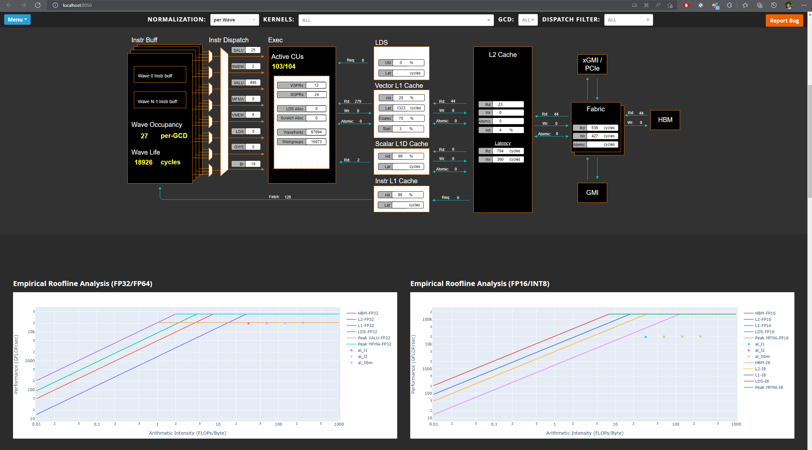

.. meta::
   :description: Omniperf analysis: Standalone GUI
   :keywords: Omniperf, ROCm, profiler, tool, Instinct, accelerator, GUI, standalone, filter

***********************
Standalone GUI analysis
***********************

Omniperf's standalone analysis GUI is a lightweight web page that you can
generate straight from the command line. The standalone analysis GUI is an
alternative to the CLI if you want to explore profiling results visually, but
without the additional setup requirements or server-side overhead of Omniperf's
detailed :doc:`Grafana interface <grafana-gui>` option. This analysis
option is implemented as a simple `Flask <https://flask.palletsprojects.com>`_
application that lets you view results from your preferred web browser.

.. note::

   A point on *port forwarding*: the standalone GUI analyzer publishes its
   web-based interface on port ``8050`` by default. On production HPC systems
   where profiling jobs run under the control of a resource manager, additional
   SSH tunneling between the desired web browser host (such as a login node or
   remote workstation) and compute host may be required. Alternatively, you
   might find it more convenient to download profiled workloads to perform
   analysis on a local system.

   See the :doc:`/reference/faq` for more details on SSH tunneling.

Launch the standalone GUI analyzer
----------------------------------

To launch the Omniperf GUI analyzer, include the ``--gui`` flag with your
desired analysis command. For example:

.. code-block:: shell

   $ omniperf analyze -p workloads/vcopy/MI200/ --gui

     ___                  _                  __ 
    / _ \ _ __ ___  _ __ (_)_ __   ___ _ __ / _|
   | | | | '_ ` _ \| '_ \| | '_ \ / _ \ '__| |_ 
   | |_| | | | | | | | | | | |_) |  __/ |  |  _|
    \___/|_| |_| |_|_| |_|_| .__/ \___|_|  |_|  
                           |_|                  

   Analysis mode = web_ui
   [analysis] deriving Omniperf metrics...
   Dash is running on http://0.0.0.0:8050/

    * Serving Flask app 'rocprof_compute_analyze.analysis_webui' (lazy loading)
    * Environment: production
      WARNING: This is a development server. Do not use it in a production deployment.
      Use a production WSGI server instead.
    * Debug mode: off
    * Running on all addresses (0.0.0.0)
      WARNING: This is a development server. Do not use it in a production deployment.
    * Running on http://127.0.0.1:8050
    * Running on http://10.228.33.172:8050 (Press CTRL+C to quit)

At this point, you can launch your web browser of choice and navigate to
``http://localhost:8050/`` to view the analysis interface.

.. tip::

   To launch the standalone GUI analyzer web app on a port other than ``8050``,
   include the optional argument ``--gui <desired port>``.

When no filters are applied, you'll see five basic sections derived from your
application's profiling data:

#. Memory Chart Analysis
#. Empirical Roofline Analysis
#. Top Stats (Top Kernel Statistics)
#. System Info
#. System Speed-of-Light

To dive deeper, use the dropdown menus at the top of the screen to isolate
particular kernels or dispatches. You should see the web page update with
metrics specific to your selected filters.

Once a filter is applied, you'll see several additional sections become
available with detailed metrics specific to that area of AMD hardware. These
detailed sections mirror the data displayed in Omniperf's
:doc:`Grafana interface <grafana-gui>`.
