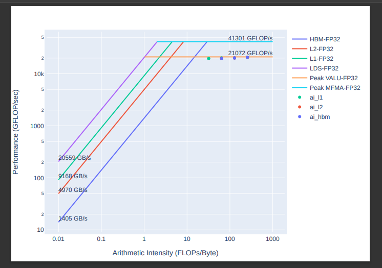

.. meta::
   :description: How to use Omniperf's profile mode
   :keywords: Omniperf, ROCm, profiler, tool, Instinct, accelerator, AMD,
              profiling, profile mode

************
Profile mode
************

The following chapter walks you through Omniperf's core profiling features by
example.

Learn about analysis with Omniperf in :doc:`../analyze/mode`. For an overview of
Omniperf's other modes, see :ref:`modes`.

Profiling
=========

Use the ``omniperf`` executable to acquire all necessary performance monitoring
data through analysis of compute workloads.

Profiling with Omniperf yields the following benefits.

* :ref:`Automate counter collection <profiling-routine>`: Omniperf handles all
  of your profiling via pre-configured input files.

* :ref:`Filtering <filtering>`: Apply runtime filters to speed up the profiling
  process.

* :ref:`Standalone roofline <standalone-roofline>`: Isolate a subset of built-in
  metrics or build your own profiling configuration.

Run ``omniperf profile -h`` for more details. See
:ref:`Basic usage <modes-profile>`.

.. _profile-example:

Profiling example
-----------------

The `<https://github.com/ROCm/omniperf/blob/amd-mainline/sample/vcopy.cpp>`__ repository
includes source code for a sample GPU compute workload, ``vcopy.cpp``. A copy of
this file is available in the ``share/sample`` subdirectory after a normal
Omniperf installation, or via the ``$OMNIPERF_SHARE/sample`` directory when
using the supplied modulefile.

The examples in this section use a compiled version of the ``vcopy`` workload to
demonstrate the use of Omniperf in MI accelerator performance analysis. Unless
otherwise noted, the performance analysis is done on the
:ref:`MI200 platform <def-soc>`.

Workload compilation
^^^^^^^^^^^^^^^^^^^^

The following example demonstrates compilation of ``vcopy``.

.. code-block:: shell

   $ hipcc vcopy.cpp -o vcopy
   $ ls
   vcopy   vcopy.cpp
   $ ./vcopy -n 1048576 -b 256
   vcopy testing on GCD 0
   Finished allocating vectors on the CPU
   Finished allocating vectors on the GPU
   Finished copying vectors to the GPU
   sw thinks it moved 1.000000 KB per wave
   Total threads: 1048576, Grid Size: 4096 block Size:256, Wavefronts:16384:
   Launching the  kernel on the GPU
   Finished executing kernel
   Finished copying the output vector from the GPU to the CPU
   Releasing GPU memory
   Releasing CPU memory

The following sample command profiles the ``vcopy`` workload.

.. code-block:: shell

   $ omniperf profile --name vcopy -- ./vcopy -n 1048576 -b 256

     ___                  _                  __ 
    / _ \ _ __ ___  _ __ (_)_ __   ___ _ __ / _|
   | | | | '_ ` _ \| '_ \| | '_ \ / _ \ '__| |_ 
   | |_| | | | | | | | | | | |_) |  __/ |  |  _|
    \___/|_| |_| |_|_| |_|_| .__/ \___|_|  |_|  
                           |_|                  

   Omniperf version: 2.0.0
   Profiler choice: rocprofv1
   Path: /home/auser/repos/omniperf/sample/workloads/vcopy/MI200
   Target: MI200
   Command: ./vcopy -n 1048576 -b 256
   Kernel Selection: None
   Dispatch Selection: None
   Hardware Blocks: All

   ~~~~~~~~~~~~~~~~~~~~~~~~~~~~~~~~
   Collecting Performance Counters
   ~~~~~~~~~~~~~~~~~~~~~~~~~~~~~~~~

   [profiling] Current input file: /home/auser/repos/omniperf/sample/workloads/vcopy/MI200/perfmon/SQ_IFETCH_LEVEL.txt
      |-> [rocprof] RPL: on '240312_174329' from '/opt/rocm-5.2.1' in '/home/auser/repos/omniperf/src/omniperf'
      |-> [rocprof] RPL: profiling '""./vcopy -n 1048576 -b 256""'
      |-> [rocprof] RPL: input file '/home/auser/repos/omniperf/sample/workloads/vcopy/MI200/perfmon/SQ_IFETCH_LEVEL.txt'
      |-> [rocprof] RPL: output dir '/tmp/rpl_data_240312_174329_692890'
      |-> [rocprof] RPL: result dir '/tmp/rpl_data_240312_174329_692890/input0_results_240312_174329'
      |-> [rocprof] ROCProfiler: input from "/tmp/rpl_data_240312_174329_692890/input0.xml"
      |-> [rocprof] gpu_index =
      |-> [rocprof] kernel =
      |-> [rocprof] range =
      |-> [rocprof] 6 metrics
      |-> [rocprof] GRBM_COUNT, GRBM_GUI_ACTIVE, SQ_WAVES, SQ_IFETCH, SQ_IFETCH_LEVEL, SQ_ACCUM_PREV_HIRES
      |-> [rocprof] vcopy testing on GCD 0
      |-> [rocprof] Finished allocating vectors on the CPU
      |-> [rocprof] Finished allocating vectors on the GPU
      |-> [rocprof] Finished copying vectors to the GPU
      |-> [rocprof] sw thinks it moved 1.000000 KB per wave
      |-> [rocprof] Total threads: 1048576, Grid Size: 4096 block Size:256, Wavefronts:16384:
      |-> [rocprof] Launching the  kernel on the GPU
      |-> [rocprof] Finished executing kernel
      |-> [rocprof] Finished copying the output vector from the GPU to the CPU
      |-> [rocprof] Releasing GPU memory
      |-> [rocprof] Releasing CPU memory
      |-> [rocprof] 
     |-> [rocprof] ROCPRofiler: 1 contexts collected, output directory /tmp/rpl_data_240312_174329_692890/input0_results_240312_174329
       |-> [rocprof] File '/home/auser/repos/omniperf/sample/workloads/vcopy/MI200/SQ_IFETCH_LEVEL.csv' is generating
      |-> [rocprof] 
   [profiling] Current input file: /home/auser/repos/omniperf/sample/workloads/vcopy/MI200/perfmon/SQ_INST_LEVEL_LDS.txt

   ...

   [roofline] Checking for roofline.csv in /home/auser/repos/omniperf/sample/workloads/vcopy/MI200
   [roofline] No roofline data found. Generating...
   Empirical Roofline Calculation
   Copyright © 2022  Advanced Micro Devices, Inc. All rights reserved.
   Total detected GPU devices: 4
   GPU Device 0: Profiling...
    99% [||||||||||||||||||||||||||||||||||||||||||||||||||||||||||| ]
  HBM BW, GPU ID: 0, workgroupSize:256, workgroups:2097152, experiments:100, traffic:8589934592 bytes, duration:6.2 ms, mean:1388.0 GB/sec, stdev=3.1 GB/sec
     99% [||||||||||||||||||||||||||||||||||||||||||||||||||||||||||| ]
  L2 BW, GPU ID: 0, workgroupSize:256, workgroups:8192, experiments:100, traffic:687194767360 bytes, duration:136.5 ms, mean:5020.8 GB/sec, stdev=16.5 GB/sec
     99% [||||||||||||||||||||||||||||||||||||||||||||||||||||||||||| ]
  L1 BW, GPU ID: 0, workgroupSize:256, workgroups:16384, experiments:100, traffic:26843545600 bytes, duration:2.9 ms, mean:9229.5 GB/sec, stdev=2.9 GB/sec
     99% [||||||||||||||||||||||||||||||||||||||||||||||||||||||||||| ]
   LDS BW, GPU ID: 0, workgroupSize:256, workgroups:16384, experiments:100, traffic:33554432000 bytes, duration:1.9 ms, mean:17645.6 GB/sec, stdev=20.1 GB/sec
    99% [||||||||||||||||||||||||||||||||||||||||||||||||||||||||||| ]
   Peak FLOPs (FP32), GPU ID: 0, workgroupSize:256, workgroups:16384, experiments:100, FLOP:274877906944, duration:13.078 ms, mean:20986.9 GFLOPS, stdev=310.8 GFLOPS
    99% [||||||||||||||||||||||||||||||||||||||||||||||||||||||||||| ]
   Peak FLOPs (FP64), GPU ID: 0, workgroupSize:256, workgroups:16384, experiments:100, FLOP:137438953472, duration:6.7 ms, mean:20408.029297.1 GFLOPS, stdev=2.7 GFLOPS
    99% [||||||||||||||||||||||||||||||||||||||||||||||||||||||||||| ]
   Peak MFMA FLOPs (BF16), GPU ID: 0, workgroupSize:256, workgroups:16384, experiments:100, FLOP:2147483648000, duration:12.6 ms, mean:170280.0 GFLOPS, stdev=22.3 GFLOPS
    99% [||||||||||||||||||||||||||||||||||||||||||||||||||||||||||| ]
   Peak MFMA FLOPs (F16), GPU ID: 0, workgroupSize:256, workgroups:16384, experiments:100, FLOP:2147483648000, duration:13.0 ms, mean:164733.6 GFLOPS, stdev=24.3 GFLOPS
    99% [||||||||||||||||||||||||||||||||||||||||||||||||||||||||||| ]
   Peak MFMA FLOPs (F32), GPU ID: 0, workgroupSize:256, workgroups:16384, experiments:100, FLOP:536870912000, duration:13.0 ms, mean:41399.6 GFLOPS, stdev=4.1 GFLOPS
    99% [||||||||||||||||||||||||||||||||||||||||||||||||||||||||||| ]
   Peak MFMA FLOPs (F64), GPU ID: 0, workgroupSize:256, workgroups:16384, experiments:100, FLOP:268435456000, duration:6.5 ms, mean:41379.2 GFLOPS, stdev=4.4 GFLOPS
    99% [||||||||||||||||||||||||||||||||||||||||||||||||||||||||||| ]
   Peak MFMA IOPs (I8), GPU ID: 0, workgroupSize:256, workgroups:16384, experiments:100, IOP:2147483648000, duration:12.9 ms, mean:166281.9 GOPS, stdev=2495.9 GOPS
   GPU Device 1: Profiling...
   ...
   GPU Device 2: Profiling...
   ...
   GPU Device 3: Profiling...
   ...

.. tip::

   To reduce verbosity of profiling output try the ``--quiet`` flag. This hides
   ``rocprof`` output and activates a progress bar.

.. _profiling-routine:

Notice the two main stages in Omniperf's *default* profiling routine.

1. The first stage collects all the counters needed for Omniperf analysis
   (omitting any filters you have provided).

2. The second stage collects data for the roofline analysis (this stage can be
   disabled using ``--no-roof``).

At the end of profiling, you can find all resulting ``csv`` files in a
:ref:`SoC <def-soc>`-specific target directory; for
example:

* "MI300A" or "MI300X" for the AMD Instinct™ MI300 family of accelerators
* "MI200" for the AMD Instinct MI200 family of accelerators
* "MI100" for the AMD Instinct MI100 family of accelerators

The SoC names are generated as a part of Omniperf, and do not *always*
distinguish between different accelerators in the same family; for instance,
an Instinct MI210 vs an Instinct MI250.

.. note::

   Additionally, you will notice a few extra files. An SoC parameters file, 
   ``sysinfo.csv``, is created to reflect the target device settings. All
   profiling output is stored in ``log.txt``. Roofline-specific benchmark
   results are stored in ``roofline.csv``.

.. code-block:: shell

   $ ls workloads/vcopy/MI200/
   total 112
   total 60
   -rw-r--r-- 1 auser agroup 27937 Mar  1 15:15 log.txt
   drwxr-xr-x 1 auser agroup     0 Mar  1 15:15 perfmon
   -rw-r--r-- 1 auser agroup 26175 Mar  1 15:15 pmc_perf.csv
   -rw-r--r-- 1 auser agroup  1708 Mar  1 15:17 roofline.csv
   -rw-r--r-- 1 auser agroup   519 Mar  1 15:15 SQ_IFETCH_LEVEL.csv
   -rw-r--r-- 1 auser agroup   456 Mar  1 15:15 SQ_INST_LEVEL_LDS.csv
   -rw-r--r-- 1 auser agroup   474 Mar  1 15:15 SQ_INST_LEVEL_SMEM.csv
   -rw-r--r-- 1 auser agroup   474 Mar  1 15:15 SQ_INST_LEVEL_VMEM.csv
   -rw-r--r-- 1 auser agroup   599 Mar  1 15:15 SQ_LEVEL_WAVES.csv
   -rw-r--r-- 1 auser agroup   650 Mar  1 15:15 sysinfo.csv
   -rw-r--r-- 1 auser agroup   399 Mar  1 15:15 timestamps.csv

.. _filtering:

Filtering
=========

To reduce profiling time and the counters collected, you should use profiling
filters. Profiling filters and their functionality depend on the underlying
profiler being used. While Omniperf is profiler-agnostic, this following is a
detailed description of profiling filters available when using Omniperf with
:doc:`ROCProfiler <rocprofiler:index>`.

Filtering options
-----------------

``-b``, ``--block <block-name>``
   Allows system profiling on one or more selected hardware components to speed
   up the profiling process. See :ref:`profiling-hw-component-filtering`.

``-k``, ``--kernel <kernel-substr>``
   Allows for kernel filtering. Usage is equivalent with the current ``rocprof``
   utility. See :ref:`profiling-kernel-filtering`.

``-d``, ``--dispatch <dispatch-id>``
   Allows for dispatch ID filtering. Usage is equivalent with the current
   ``rocprof`` utility. See :ref:`profiling-dispatch-filtering`.

.. tip::

   Be cautious when combining different profiling filters in the same call.
   Conflicting filters may result in error.

   For example, filtering a dispatch, but that dispatch doesn't match your
   kernel name filter.

.. _profiling-hw-component-filtering:

Hardware component filtering
^^^^^^^^^^^^^^^^^^^^^^^^^^^^

You can profile specific hardware components to speed up the profiling process.
In Omniperf, the term hardware block to refers to a hardware component or a
group of hardware components. All profiling results are accumulated in the same
target directory without overwriting those for other hardware components. This
enables incremental profiling and analysis.

The following example only gathers hardware counters for the shader sequencer
(SQ) and L2 cache (TCC) components, skipping all other hardware components.

.. code-block:: shell

   $ omniperf profile --name vcopy -b SQ TCC -- ./vcopy -n 1048576 -b 256

     ___                  _                  __ 
    / _ \ _ __ ___  _ __ (_)_ __   ___ _ __ / _|
   | | | | '_ ` _ \| '_ \| | '_ \ / _ \ '__| |_ 
   | |_| | | | | | | | | | | |_) |  __/ |  |  _|
    \___/|_| |_| |_|_| |_|_| .__/ \___|_|  |_|  
                           |_|                  

   fname: pmc_cpc_perf: Skipped
   fname: pmc_spi_perf: Skipped
   fname: pmc_cpf_perf: Skipped
   fname: pmc_tcp_perf: Skipped
   fname: pmc_sq_perf4: Added
   fname: pmc_tcc_perf: Added
   fname: pmc_sq_perf8: Added
   fname: pmc_ta_perf: Skipped
   fname: pmc_sq_perf1: Added
   fname: pmc_sq_perf3: Added
   fname: pmc_td_perf: Skipped
   fname: pmc_tcc2_perf: Skipped
   fname: pmc_sqc_perf1: Skipped
   fname: pmc_sq_perf6: Added
   fname: pmc_sq_perf2: Added
   Omniperf version: 2.0.0
   Profiler choice: rocprofv1
   Path: /home/auser/repos/omniperf/sample/workloads/vcopy/MI200
   Target: MI200
   Command: ./vcopy -n 1048576 -b 256
   Kernel Selection: None
   Dispatch Selection: None
   Hardware Blocks: ['sq', 'tcc']

   ~~~~~~~~~~~~~~~~~~~~~~~~~~~~~~~~
   Collecting Performance Counters
   ~~~~~~~~~~~~~~~~~~~~~~~~~~~~~~~~
   ...

.. _profiling-kernel-filtering:

Kernel filtering
^^^^^^^^^^^^^^^^

Kernel filtering is based on the name of the kernels you want to isolate. Use a
kernel name substring list to isolate desired kernels.

The following example demonstrates profiling isolating the kernel matching
substring ``vecCopy``.

.. code-block:: shell

   $ omniperf profile --name vcopy -k vecCopy -- ./vcopy -n 1048576 -b 256

     ___                  _                  __ 
    / _ \ _ __ ___  _ __ (_)_ __   ___ _ __ / _|
   | | | | '_ ` _ \| '_ \| | '_ \ / _ \ '__| |_ 
   | |_| | | | | | | | | | | |_) |  __/ |  |  _|
    \___/|_| |_| |_|_| |_|_| .__/ \___|_|  |_|  
                           |_|                  

   Omniperf version: 2.0.0
   Profiler choice: rocprofv1
   Path: /home/auser/repos/omniperf/sample/workloads/vcopy/MI200
   Target: MI200
   Command: ./vcopy -n 1048576 -b 256
   Kernel Selection: ['vecCopy']
   Dispatch Selection: None
   Hardware Blocks: All

   ~~~~~~~~~~~~~~~~~~~~~~~~~~~~~~~~
   Collecting Performance Counters
   ~~~~~~~~~~~~~~~~~~~~~~~~~~~~~~~~
   ...

.. _profiling-dispatch-filtering:

Dispatch filtering
^^^^^^^^^^^^^^^^^^

Dispatch filtering is based on the *global* dispatch index of kernels in a run. 

The following example profiles only the first kernel dispatch in the execution
of the application (note zero-based indexing).

.. code-block:: shell

   $ omniperf profile --name vcopy -d 0 -- ./vcopy -n 1048576 -b 256

     ___                  _                  __ 
    / _ \ _ __ ___  _ __ (_)_ __   ___ _ __ / _|
   | | | | '_ ` _ \| '_ \| | '_ \ / _ \ '__| |_ 
   | |_| | | | | | | | | | | |_) |  __/ |  |  _|
    \___/|_| |_| |_|_| |_|_| .__/ \___|_|  |_|  
                           |_|                  

   Omniperf version: 2.0.0
   Profiler choice: rocprofv1
   Path: /home/auser/repos/omniperf/sample/workloads/vcopy/MI200
   Target: MI200
   Command: ./vcopy -n 1048576 -b 256
   Kernel Selection: None
   Dispatch Selection: ['0']
   Hardware Blocks: All

   ~~~~~~~~~~~~~~~~~~~~~~~~~~~~~~~~
   Collecting Performance Counters
   ~~~~~~~~~~~~~~~~~~~~~~~~~~~~~~~~
   ...

.. _standalone-roofline:

Standalone roofline
===================

If you are only interested in generating roofline analysis data try using
``--roof-only``. This will only collect counters relevant to roofline, as well
as generate a standalone ``.pdf`` output of your roofline plot. 

Roofline options
----------------

``--sort <desired_sort>``
   Allows you to specify whether you would like to overlay top kernel or top
   dispatch data in your roofline plot.

``-m``, ``--mem-level <cache_level>``
   Allows you to specify specific levels of cache to include in your roofline
   plot.

``--device <gpu_id>``
   Allows you to specify a device ID to collect performance data from when
   running a roofline benchmark on your system.

To distinguish different kernels in your ``.pdf`` roofline plot use
``--kernel-names``. This will give each kernel a unique marker identifiable from
the plot's key.

Roofline only
-------------

The following example demonstrates profiling roofline data only:

.. code-block:: shell

   $ omniperf profile --name vcopy --roof-only -- ./vcopy -n 1048576 -b 256

   ...
   [roofline] Checking for roofline.csv in /home/auser/repos/omniperf/sample/workloads/vcopy/MI200
   [roofline] No roofline data found. Generating...
   Checking for roofline.csv in /home/auser/repos/omniperf/sample/workloads/vcopy/MI200
   Empirical Roofline Calculation
   Copyright © 2022  Advanced Micro Devices, Inc. All rights reserved.
   Total detected GPU devices: 4
   GPU Device 0: Profiling...
    99% [||||||||||||||||||||||||||||||||||||||||||||||||||||||||||| ]
    ...
   Empirical Roofline PDFs saved!

An inspection of our workload output folder shows ``.pdf`` plots were generated
successfully.

.. code-block:: shell

   $ ls workloads/vcopy/MI200/
   total 48
   -rw-r--r-- 1 auser agroup 13331 Mar  1 16:05 empirRoof_gpu-0_fp32_fp64.pdf
   -rw-r--r-- 1 auser agroup 13136 Mar  1 16:05 empirRoof_gpu-0_int8_fp16.pdf
   drwxr-xr-x 1 auser agroup     0 Mar  1 16:03 perfmon
   -rw-r--r-- 1 auser agroup  1101 Mar  1 16:03 pmc_perf.csv
   -rw-r--r-- 1 auser agroup  1715 Mar  1 16:05 roofline.csv
   -rw-r--r-- 1 auser agroup   650 Mar  1 16:03 sysinfo.csv
   -rw-r--r-- 1 auser agroup   399 Mar  1 16:03 timestamps.csv

.. note::

   Omniperf generates two roofline outputs to organize results and reduce
   clutter. One chart plots FP32/FP64 performance while the other plots I8/FP16
   performance.

The following image is a sample ``empirRoof_gpu-ALL_fp32_fp64.pdf`` roofline
plot.

