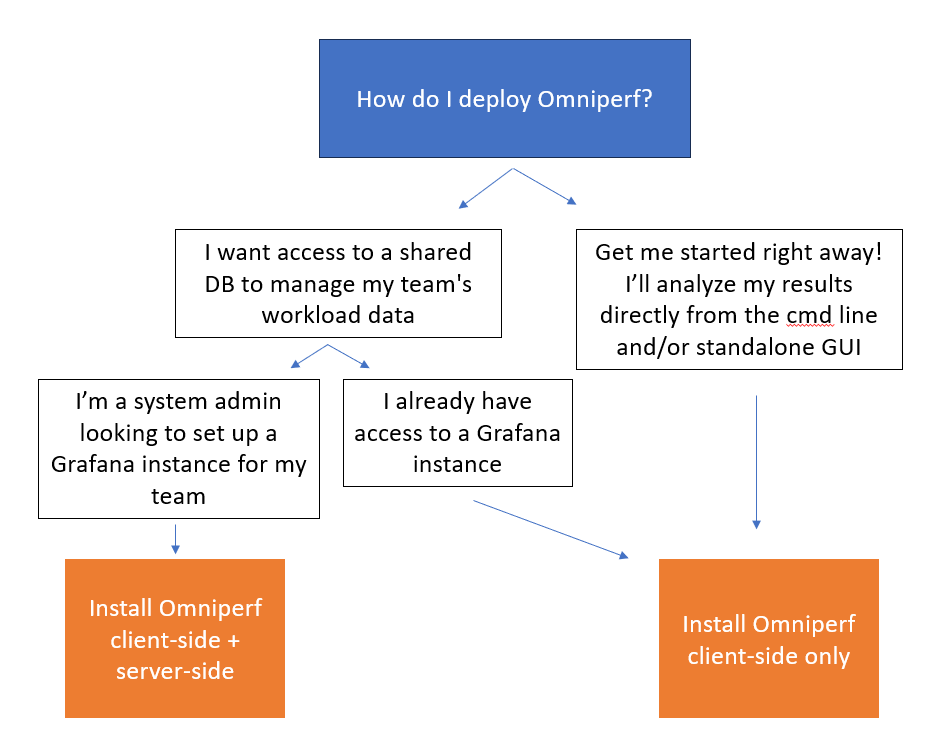

.. meta::
   :description: Omniperf installation and deployment
   :keywords: Omniperf, ROCm, profiler, tool, Instinct, accelerator, AMD,
              install, deploy, Grafana, client, configuration, modulefiles

*********************************
Installing and deploying Omniperf
*********************************

Omniperf consists of two installation components.

* :ref:`Omniperf core installation <core-install>` (client-side)

  * Provides the core application profiling capability.
  * Allows the collection of performance counters, filtering by hardware
    block, dispatch, kernel, and more.
  * Provides a CLI-based analysis mode.
  * Provides a standalone web interface for importing analysis metrics.

* :doc:`Grafana server for Omniperf <grafana-setup>` (server-side) (*optional*)

  * Hosts the MongoDB backend and Grafana instance.
  * Is packaged in a Docker container for easy setup.

Determine what you need to install based on how you would like to interact with
Omniperf. See the following decision tree to help determine what installation is
right for you.

.. _core-install:
 
Core installation
=================

The core Omniperf application requires the following basic software
dependencies. As of ROCm 6.2, the core Omniperf is included with your ROCm
installation.

* Python ``>= 3.8``
* CMake ``>= 3.19``
* ROCm ``>= 5.7.1``

Omniperf depends on a number of Python packages documented in the top-level
``requirements.txt`` file. Install these *before* configuring Omniperf.

.. tip::

   If looking to build Omniperf as a developer, consider these additional
   requirements.

   .. list-table::

       * - ``docs/sphinx/requirements.txt``
         - Python packages required to build this documentation from source.

       * - ``requirements-test.txt``
         - Python packages required to run Omniperf's CI suite using PyTest.

The recommended procedure for Omniperf usage is to install into a shared file
system so that multiple users can access the final installation. The
following steps illustrate how to install the necessary Python dependencies
using `pip <https://packaging.python.org/en/latest/>`_ and Omniperf into a
shared location controlled by the ``INSTALL_DIR`` environment variable.

.. _core-install-cmake-vars:

Configuration variables
-----------------------
The following installation example leverages several
`CMake <https://cmake.org/cmake/help/latest>`_ project variables defined as
follows.

.. list-table::
    :header-rows: 1

    * - CMake variable
      - Description

    * - ``CMAKE_INSTALL_PREFIX``
      - Controls the install path for Omniperf files.

    * - ``PYTHON_DEPS``
      - Specifies an optional path to resolve Python package dependencies.

    * - ``MOD_INSTALL_PATH``
      - Specifies an optional path for separate Omniperf modulefile installation.

.. _core-install-steps:

Install from source
-------------------

#. A typical install begins by downloading the latest release tarball available
   from `<https://github.com/ROCm/omniperf/releases>`__. From there, untar and
   navigate into the top-level directory.

   ..
      {{ config.version }} substitutes the Omniperf version in ../conf.py

   .. datatemplate:nodata::

      .. code-block:: shell

         tar xfz omniperf-v{{ config.version }}.tar.gz
         cd omniperf-v{{ config.version }}

#. Next, install Python dependencies and complete the Omniperf configuration and
   install process.

   .. datatemplate:nodata::

      .. code-block:: shell

         # define top-level install path
         export INSTALL_DIR=<your-top-level-desired-install-path>

         # install python deps
         python3 -m pip install -t ${INSTALL_DIR}/python-libs -r requirements.txt

         # configure Omniperf for shared install
         mkdir build
         cd build
         cmake -DCMAKE_INSTALL_PREFIX=${INSTALL_DIR}/{{ config.version }} \
                 -DPYTHON_DEPS=${INSTALL_DIR}/python-libs \
                 -DMOD_INSTALL_PATH=${INSTALL_DIR}/modulefiles ..

         # install
         make install

   .. tip::

      You might need to ``sudo`` the final installation step if you don't have
      write access for the chosen installation path.

#. Upon successful installation, your top-level installation directory should
   look like this.

   .. datatemplate:nodata::

      .. code-block:: shell

         $ ls $INSTALL_DIR
         modulefiles  {{ config.version }}  python-libs

.. _core-install-modulefiles:

Execution using modulefiles
^^^^^^^^^^^^^^^^^^^^^^^^^^^

The installation process includes the creation of an environment modulefile for
use with `Lmod <https://lmod.readthedocs.io>`_. On systems that support Lmod,
you can register the Omniperf modulefile directory and setup your environment
for execution of Omniperf as follows.

.. datatemplate:nodata::

   .. code-block:: shell

      $ module use $INSTALL_DIR/modulefiles
      $ module load omniperf
      $ which omniperf
      /opt/apps/omniperf/{{ config.version }}/bin/omniperf

      $ omniperf --version
      ROC Profiler:   /opt/rocm-5.1.0/bin/rocprof

      omniperf (v{{ config.version }})

.. tip::

   If you're relying on an Lmod Python module locally, you may wish to customize
   the resulting Omniperf modulefile post-installation to include extra
   module dependencies.

Execution without modulefiles
^^^^^^^^^^^^^^^^^^^^^^^^^^^^^

To use Omniperf without the companion modulefile, update your ``PATH``
settings to enable access to the command line binary. If you installed Python
dependencies in a shared location, also update your ``PYTHONPATH``
configuration.

.. datatemplate:nodata::

   .. code-block:: shell

      export PATH=$INSTALL_DIR/{{ config.version }}/bin:$PATH
      export PYTHONPATH=$INSTALL_DIR/python-libs

.. _core-install-package:

Install via package manager
---------------------------

Once ROCm (minimum version 6.2.0) is installed, you can install Omniperf using
your operating system's native package manager using the following commands.
See :doc:`rocm-install-on-linux:index` for guidance on installing the ROCm
software stack.

.. tab-set::

   .. tab-item:: Ubuntu

      .. code-block:: shell

         $ sudo apt install omniperf
         $ pip install -r /opt/rocm/libexec/omniperf/requirements.txt

   .. tab-item:: Red Hat Enterprise Linux

      .. code-block:: shell

         $ sudo dnf install omniperf
         $ pip install -r /opt/rocm/libexec/omniperf/requirements.txt

   .. tab-item:: SUSE Linux Enterprise Server

      .. code-block:: shell

         $ sudo zypper install omniperf
         $ pip install -r /opt/rocm/libexec/omniperf/requirements.txt

.. _core-install-rocprof-var:

ROCProfiler
-----------

Omniperf relies on :doc:`ROCProfiler <rocprofiler:index>`'s ``rocprof`` binary
during the profiling process. Normally, the path to this binary is detected
automatically, but you can override the path by the setting the optional
``ROCPROF`` environment variable.

