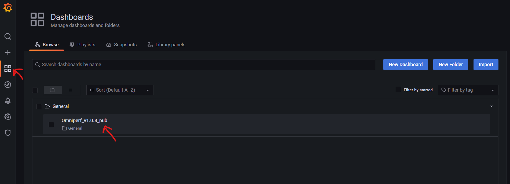

.. meta::
   :description: Omniperf Grafana server installation and deployment
   :keywords: Omniperf, ROCm, profiler, tool, Instinct, accelerator, AMD,
              install, deploy, Grafana, server, configuration, GUI

****************************************
Setting up a Grafana server for Omniperf
****************************************

A Grafana server is *not required* to profile or analyze performance data
from the CLI. It's a supplementary mechanism to help you import performance
data and examine it in a detailed
`Grafana <https://github.com/grafana/grafana>`_ dashboard GUI.

Learn about installing and configuring the main Omniperf tool in
:ref:`core-install`.

Setting up a Grafana instance for Omniperf requires the following basic software
dependencies.

* `Docker Engine <https://docs.docker.com/engine/install/>`_

The recommended process for enabling the server-side of Omniperf is to use the
provided ``Dockerfile`` to build the Grafana and MongoDB instance.

.. _grafana-mongodb-setup:

Set up Grafana and MongoDB
==========================

Once you've decided where to host the Grafana and MongoDB instance, complete the
the following setup instructions.

Install MongoDB utilities
-------------------------

Omniperf uses the
`mongoimport <https://www.mongodb.com/docs/database-tools/mongoimport/>`_
utility to upload data to your Grafana instance's backend database.

Use the following commands to install MongoDB utilities for Ubuntu 20.04.

.. code-block:: bash

   $ wget https://fastdl.mongodb.org/tools/db/mongodb-database-tools-ubuntu2004-x86_64-100.6.1.deb
   $ sudo apt install ./mongodb-database-tools-ubuntu2004-x86_64-100.6.1.deb

.. note::

   Find installation instructions for other distributions in
   `MongoDB Database Tools Downloads <https://www.mongodb.com/download-center/database-tools/releases/archive>`_.

.. _grafana-persistent-storage-setup:

Set up persistent storage
-------------------------

Bind MongoDB to a directory on the host OS to create a local backup in case of a
crash or reset. This is called *creating a persistent volume*.

.. code-block:: bash

   $ sudo mkdir -p /usr/local/persist && cd /usr/local/persist/
   $ sudo mkdir -p grafana-storage mongodb
   $ sudo docker volume create --driver local --opt type=none --opt device=/usr/local/persist/grafana-storage --opt o=bind grafana-storage
   $ sudo docker volume create --driver local --opt type=none --opt device=/usr/local/persist/mongodb --opt o=bind grafana-mongo-db

.. _grafana-docker-container:

Build and launch the Docker container
-------------------------------------

You're now ready to build your ``Dockerfile``. Navigate to your Omniperf install
directory to begin.

.. code-block:: bash

   $ cd grafana
   $ sudo docker-compose build
   $ sudo docker-compose up -d

The TCP ports for Grafana (``4000``) and MongoDB (``27017``) in the Docker
container are mapped to ``14000`` and ``27018``, respectively, on the host side.

.. tip::

   In the event that either your Grafana or MongoDB instance crashes fatally,
   just restart the server. Navigate to your install directory and run:

   .. code-block::

      $ sudo docker-compose down
      $ sudo docker-compose up -d

.. _grafana-dashboard-setup:

Set up the Grafana dashboard
----------------------------

Once you've launched your Docker container you should be able to reach Grafana
at ``http://<host-ip>:14000``. The default login credentials for your first-time
Grafana setup are:

* **Username**: ``admin``
* **Password**: ``admin``

   Grafana's welcome screen.

.. _grafana-datasource-setup:

Configure the MongoDB data source
---------------------------------

You must configure your MongoDB data source in Grafana before first-time use.
Navigate to Grafana's **Configuration** page to add the "Omniperf Data"
connection.

   Grafana's Configuration page.

Configure the following fields in the data source settings.

.. list-table::
   :stub-columns: 1

   * - HTTP URL
     - ``http://localhost:3333``

   * - MongoDB URL
     - ``mongodb://temp:temp123@\<host-ip>:27018/admin?authSource=admin``

   * - Database Name
     - ``admin``

After configuring these fields, click **Save & test** to make sure your
connection is successful.

   Grafana data source settings.

.. note::

   To avoid potential DNS issues, you might need to use the actual IP address
   for the host node in the MongoDB URL.

.. _grafana-import-dashboard-file:

Import the Omniperf dashboard file
----------------------------------

From the **Create** → **Import** page, upload the dashboard file,
``/dashboards/Omniperf_v{__VERSION__}_pub.json`` from the
:doc:`Omniperf tarball <core-install>`.

Edit both the dashboard **Name** and the **Unique identifier (UID)** fields to
uniquely identify the dashboard. Click **Import** to complete the process.

   Grafana's Import dashboard.

.. _grafana-select-workload:

Select and load the Omniperf workload
-------------------------------------

Once you have imported a dashboard you're ready to begin. Start by browsing
available dashboards and selecting the dashboard you have just imported.

   Opening your Omniperf profiling dashboard in Grafana.

Remember that you need to upload workload data to the MongoDB backend before
analyzing in your Grafana interface. See a detailed example of this in 
:ref:`grafana-gui-import`.

After a workload has been successfully uploaded, you should be able to select it
from the workload dropdown located at the top of your Grafana dashboard.

   Selecting your Omniperf workload in Grafana.

For more information on how to use the Grafana interface for analysis see
:doc:`/how-to/analyze/grafana-gui`.

