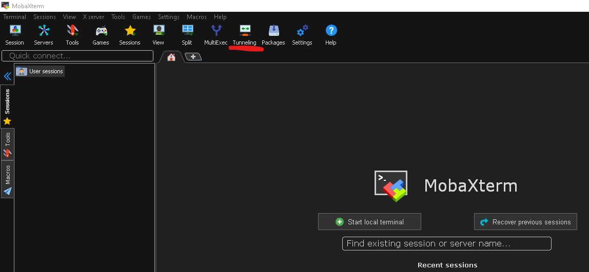
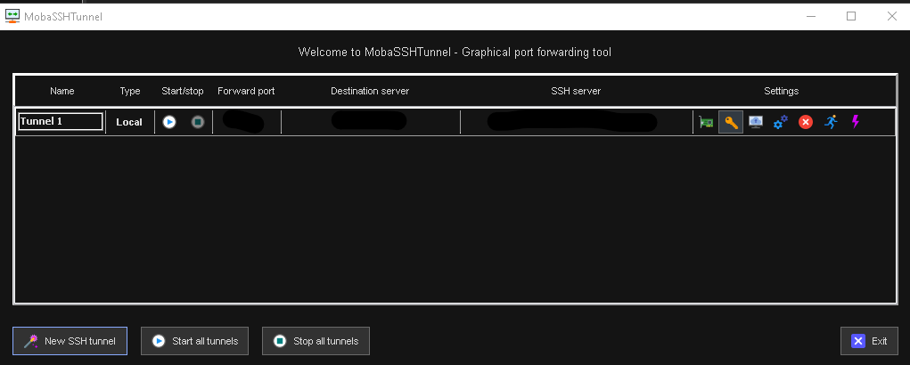
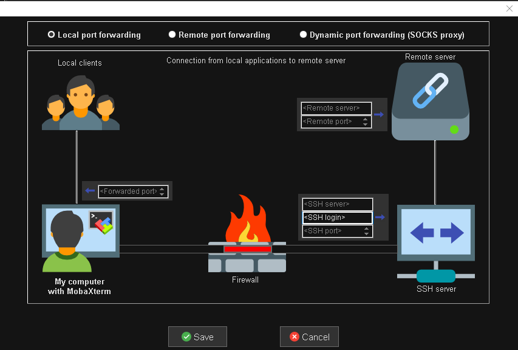

.. meta::
    :description: Omniperf FAQ and troubleshooting
    :keywords: Omniperf, FAQ, troubleshooting, ROCm, profiler, tool, Instinct, accelerator, AMD

***
FAQ
***

Frequently asked questions and troubleshooting tips.

1. How do I export profiling data I have already generated using Omniperf?
==========================================================================

To interact with the Grafana GUI, you must sync data with the MongoDB backend.
This interaction is done through :ref:`database <modes-database>` mode.

Pass the directory of your desired workload like so,

.. code:: bash

    $ omniperf database --import -w <path-to-results> -H <hostname> -u <username> -t <team-name>

2. python ast error: 'Constant' object has no attribute 'kind'
==============================================================

This comes from a bug in the default astunparse 1.6.3 with python 3.8. Seems
good with python 3.7 and 3.9.

Workaround:
```shell
$ pip3 uninstall astunparse
$ pip3 astunparse
```

**3. tabulate doesn't print properly**
Workaround:
```shell
$ export LC_ALL=C.UTF-8
$ export LANG=C.UTF-8
```

3. How can I SSH Tunnel in MobaXterm?
=====================================

1. Open MobaXterm
2. In the top ribbon, select `Tunneling`



This pop up will appear



3. Press `New SSH tunnel`



4. Configure tunnel accordingly

   Local clients
   - Forwarded Port: [PORT]

   Remote Server
   - Remote Server: localhost
   - Remote Port: [PORT]

   SSH Server
   - SSH server: name of the server one is connecting to
   - SSH login: username to login to the server
   - SSH port: 22
