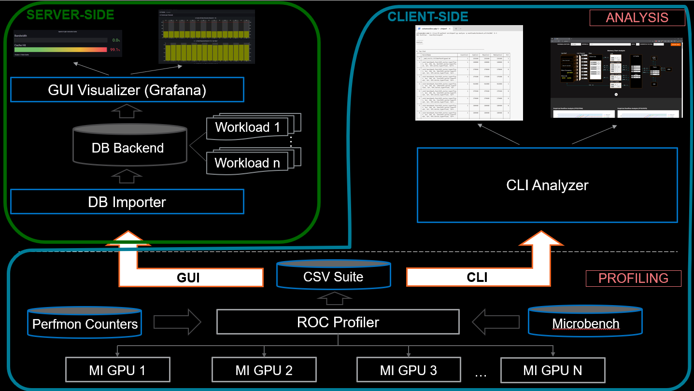

.. meta::
   :description: What is ROCm Compute Profiler?
   :keywords: ROCm Compute Profiler, ROCm, profiler, tool, Instinct, accelerator, AMD

*****************
What is ROCm Compute Profiler?
*****************

ROCm Compute Profiler is a kernel-level profiling tool for machine learning and high
performance computing (HPC) workloads running on AMD Instinct™ accelerators.

AMD Instinct MI-series accelerators are data center-class GPUs designed for
compute and have some graphics capabilities disabled or removed. ROCm Compute Profiler
primarily targets use with
:doc:`accelerators in the MI300, MI200, and MI100 families <rocm:conceptual/gpu-arch>`.
Development is in progress to support Radeon™ (RDNA) GPUs.

ROCm Compute Profiler is built on top of :doc:`ROCProfiler <rocprofiler:rocprofv1>` to
monitor hardware performance counters.

.. _high-level-design:

High-level design of ROCm Compute Profiler
=============================

The architecture of ROCm Compute Profiler consists of three major components shown in the
following diagram.

Core ROCm Compute Profiler profiler
----------------------

Acquires raw performance counters via application replay using ``rocprof``.
Counters are stored in a comma-separated-values format for further
:doc:`analysis <how-to/analyze/mode>`. It runs a set of accelerator-specific
micro-benchmarks to acquire hierarchical roofline data. The roofline model is
not available on accelerators pre-MI200.

Grafana server for ROCm Compute Profiler
---------------------------

* **Grafana database import**: All raw performance counters are imported into
  a :ref:`backend MongoDB database <grafana-mongodb-setup>` to support
  analysis and visualization in the Grafana GUI. Compatibility with
  previously generated data using older ROCm Compute Profiler versions is not guaranteed.

* **Grafana analysis dashboard GUI**: The
  :doc:`Grafana dashboard <how-to/analyze/grafana-gui>` retrieves the raw
  counters information from the backend database. It displays the relevant
  performance metrics and visualization.

ROCm Compute Profiler standalone GUI analyzer
--------------------------------

ROCm Compute Profiler provides a :doc:`standalone GUI <how-to/analyze/standalone-gui>` to
enable basic performance analysis without the need to import data into a
database instance. Find setup instructions in :doc:`install/grafana-setup`

ROCm Compute Profiler features
=================

ROCm Compute Profiler offers comprehensive profiling based on all available hardware counters
for the target accelerator. It delivers advanced performance analysis features,
such as system Speed-of-Light (SOL) and hardware block-level SOL evaluations.
Additionally, ROCm Compute Profiler provides in-depth memory chart analysis, roofline
analysis, baseline comparisons, and more, ensuring a thorough understanding of
system performance.

ROCm Compute Profiler supports analysis through both the :doc:`command line </how-to/analyze/cli>` or a
:doc:`GUI </how-to/analyze/grafana-gui>`. The following list describes ROCm Compute Profiler's features at a
high level.

* :doc:`Support for AMD Instinct MI300, MI200, and MI100 accelerators <reference/compatible-accelerators>`

* :doc:`Standalone GUI analyzer </how-to/analyze/standalone-gui>`

* :doc:`GUI analyzer via Grafana and MongoDB </how-to/analyze/grafana-gui>`

  * :ref:`System Info panel <grafana-panel-sys-info>`

  * :ref:`Kernel Statistic panel <grafana-panel-kernel-stats>`

  * :ref:`System Speed-of-Light panel <grafana-panel-system-sol>`

  * :ref:`Memory Chart Analysis panel <grafana-panel-memory-chart-analysis>`

  * :ref:`Roofline Analysis panel <grafana-panel-roofline-analysis>`
    (*Supported on MI200 only, Ubuntu 20.04, SLES 15 SP3 or RHEL8*)

  * :ref:`Command Processor (CP) panel <grafana-panel-cp>`

  * :ref:`Workgroup Manager (SPI) panel <grafana-panel-spi>`

  * :ref:`Wavefront Launch panel <grafana-panel-wavefront>`

  * :ref:`Compute Unit - Instruction Mix panel <grafana-panel-cu-instruction-mix>`

  * :ref:`Compute Unit - Pipeline panel <grafana-panel-cu-compute-pipeline>`

  * :ref:`Local Data Share (LDS) panel <grafana-panel-lds>`

  * :ref:`Instruction Cache panel <grafana-panel-instruction-cache>`

  * :ref:`Scalar L1D Cache panel <grafana-panel-sl1d-cache>`

  * :ref:`L1 Address Processing Unit, or, Texture Addresser (TA) <grafana-panel-ta>`
    and :ref:`L1 Backend Data Processing Unit, or, Texture Data (TD) <grafana-panel-td>` panels

  * :ref:`Vector L1D Cache panel <grafana-panel-vl1d>`

  * :ref:`L2 Cache panel <grafana-panel-l2-cache>`

  * :ref:`L2 Cache (per-channel) panel <grafana-panel-l2-cache-per-channel>`

* :ref:`Filtering <filtering>` to reduce profiling time

  * Filtering by dispatch

  * Filter by kernel

  * Filtering by GPU ID

* :ref:`Baseline comparisons <analysis-baseline-comparison>`

* :ref:`Multiple normalizations <normalization-units>`
