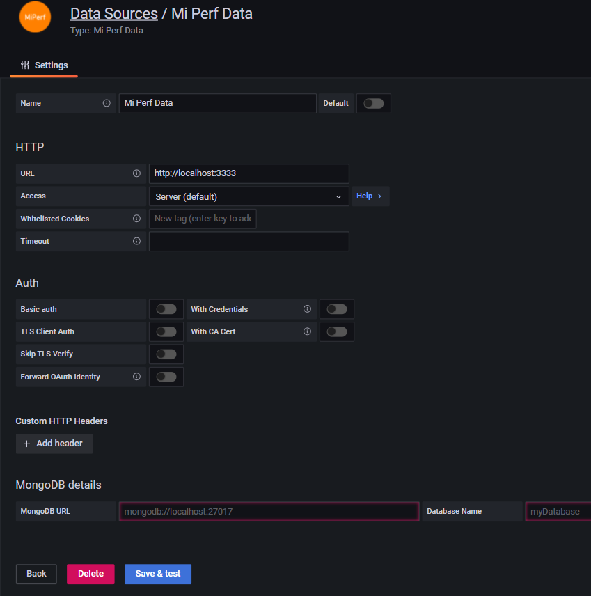

# ROCm Compute Profiler Data Source Plugin

This plugin allows users of ROCm Compute Profiler to connect their MongoDB database to for visualization in Grafana

## Info

This backend exposes the endpoints Grafana requires to create a custom data source. 

An express server, located in the `server` folder exposes these endpoints and makes the proxy to the MongoDB.

## Dependencies

- Node.js

`sudo apt-get install -y npm`
   
## Useage

