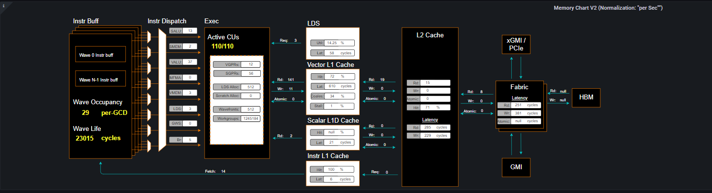
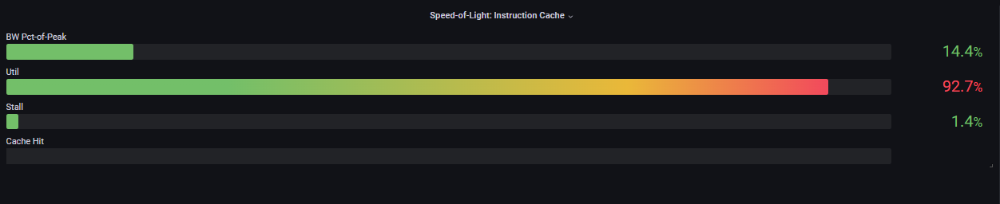
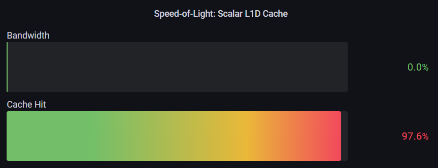
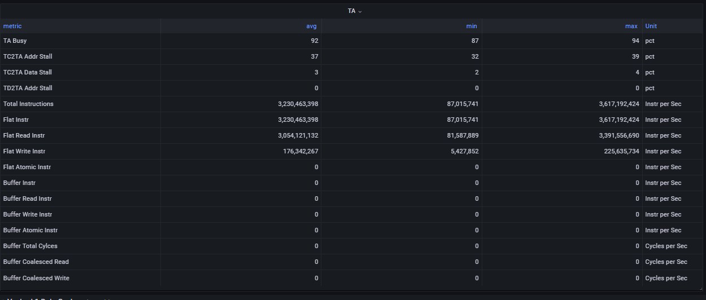
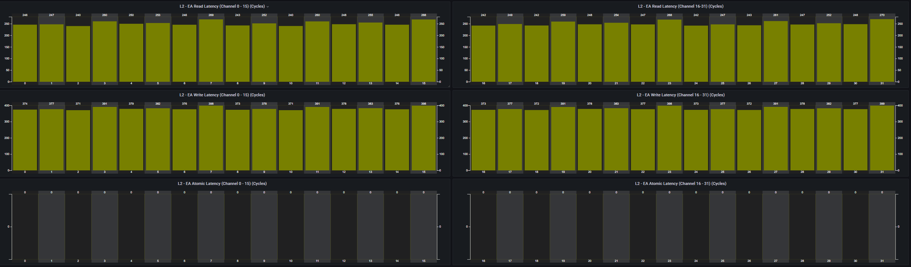
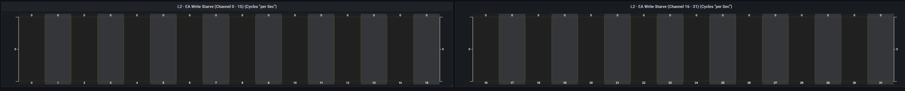

# Grafana-based Analysis

```eval_rst
.. toctree::
   :glob:
   :maxdepth: 4
```

## Features
The Omniperf Grafana GUI Analyzer supports the following features to facilitate MI GPU performance profiling and analysis:

- System and IP-Block Speed-of-Light (SOL)
- Multiple normalization options, including per-cycle, per-wave, per-kernel and per-second.
- Baseline comparisons 
- Regex based Dispatch ID filtering
- Roofline Analysis
- Detailed per IP Block performance counters and metrics
  - CPC/CPF
  - SPI
  - SQ
  - SQC
  - TA/TD
  - TCP
  - TCC (both aggregated and per-channel perf info)

### Speed-of-Light
Speed-of-light panels are provided at both the system and per IP block level to help diagnosis performance bottlenecks. The performance numbers of the workload under testing are compared to the theoretical maximum, (e.g. floating point operations, bandwidth, cache hit rate, etc.), to indicate the available room to further utilize the hardware capability.

### Multi Normalization

Multiple performance number normalizations are provided to allow performance inspection within both HW and SW context. The following normalizations are permitted:
- per cycle
- per wave
- per kernel
- per second

### Baseline Comparison
Omniperf enables baseline comparison to allow checking A/B effect. The current release limits the baseline comparison to the same SoC. Cross comparison between SoCs is in development.

For both the Current Workload and the Baseline Workload, one can independently setup the following filters to allow fine grained comparions:
- Workload Name 
- GPU ID filtering (multi selection)
- Kernel Name filtering (multi selection)
- Dispatch ID filtering (Regex filtering)
- Omniperf Panels (multi selection)

### Regex based Dispatch ID filtering
This release enables regex based dispatch ID filtering to flexibly choose the kernel invocations. One may refer to [Regex Numeric Range Generator](https://3widgets.com/), to generate typical number ranges. 

For example, if one wants to inspect Dispatch Range from 17 to 48, inclusive, the corresponding regex is : **(1[7-9]|[23]\d|4[0-8])**. The generated express can be copied over for filtering.

### Incremental Profiling
Omniperf supports incremental profiling to significantly speed up performance analysis.

> Refer to [*IP Block profiling*](https://amdresearch.github.io/omniperf/performance_analysis.html#ip-block-profiling) section for this command. 

By default, the entire application is profiled to collect perfmon counter for all IP blocks, giving a system level view of where the workload stands in terms of performance optimization opportunities and bottlenecks. 

After that one may focus on only a few IP blocks, (e.g., L1 Cache or LDS) to closely check the effect of software optimizations, without performing application replay for all other IP Blocks. This saves lots of compute time. In addition, the prior profiling results for other IP blocks are not overwritten. Instead, they can be merged during the import to piece together the system view. 

### Color Coding
The uniform color coding is applied to most visualizations (bars, table, diagrams etc). Typically, Yellow color means over 50%, while Red color mean over 90% percent, for easy inspection.

### Global Variables and Configurations


## Omniperf Panels

### Overview

There are currently 18 main panel categories available for analyzing the compute workload performance. Each category contains several panels for close inspection of the system performance.

- Kernel Statistics
  - Kernel time histogram
  - Top Ten bottleneck kernels
- System Speed-of-Light
  - Speed-of-Light
  - System Info table
- Memory Chart Analysis
- Roofline Analysis
  - FP32/FP64
  - FP16/INT8
- Command Processor
  - Command Processor - Fetch (CPF)
  - Command Processor - Controller (CPC)
- Shader Processing Input (SPI)
  - SPI Stats
  - SPI Resource Allocations
- Wavefront Launch
  - Wavefront Launch Stats
  - Wavefront runtime stats
  - per-SE Wavefront Scheduling performance
- Wavefront Lifetime
  - Wavefront lifetime breakdown
  - per-SE wavefront life (average)
  - per-SE wavefront life (histogram)
- Wavefront Occupancy
  - per-SE wavefront occupancy
  - per-CU wavefront occupancy
- Compute Unit - Instruction Mix
  - per-wave Instruction mix
  - per-wave VALU Arithmetic instruction mix
  - per-wave MFMA Arithmetic instruction mix
- Compute Unit - Compute Pipeline
  - Speed-of-Light: Compute Pipeline
  - Arithmetic OPs count
  - Compute pipeline stats
  - Memory latencies
- Local Data Share (LDS)
  - Speed-of-Light: LDS
  - LDS stats
- Instruction Cache
  - Speed-of-Light: Instruction Cache
  - Instruction Cache Accesses
- Constant Cache
  - Speed-of-Light: Constant Cache
  - Constant Cache Accesses
  - Constant Cache - L2 Interface stats
- Texture Address and Texture Data
  - Texture Address (TA)
  - Texture Data (TD)
- L1 Cache
  - Speed-of-Light: L1 Cache
  - L1 Cache Accesses
  - L1 Cache Stalls
  - L1 - L2 Transactions
  - L1 - UTCL1 Interface stats
- L2 Cache
  - Speed-of-Light: L2 Cache
  - L2 Cache Accesses
  - L2 - EA Transactions
  - L2 - EA Stalls
- L2 Cache Per Channel Performance
  - Per-channel L2 Hit rate
  - Per-channel L1-L2 Read requests
  - Per-channel L1-L2 Write Requests
  - Per-channel L1-L2 Atomic Requests
  - Per-channel L2-EA Read requests
  - Per-channel L2-EA Write requests
  - Per-channel L2-EA Atomic requests
  - Per-channel L2-EA Read latency
  - Per-channel L2-EA Write latency
  - Per-channel L2-EA Atomic  latency
  - Per-channel L2-EA Read stall (I/O, GMI, HBM)
  - Per-channel L2-EA Write stall (I/O, GMI, HBM, Starve)

Most panels are designed around a specific IP block to thoroughly understand its behavior. Additional panels, including custom panels, could also be added to aid the performance analysis.

### System Info Panel

### Kernel Statistics

#### Kernel Time Histogram

#### Top Bottleneck Kernels

#### Top Bottleneck Dispatches

#### Current and Baseline Dispatch IDs (Filtered)


### System Speed-of-Light


### Memory Chart Analysis
> Note: The Memory Chart Analysis support multiple normalizations. Due to the space limit, all transactions, when normalized to per-sec, default to unit of Billion transactions per second.



### Roofline Analysis

### Command Processor

### Shader Processing Input (SPI)

### Wavefront Launch


### Compute Unit - Instruction Mix
#### Instruction Mix

#### VALU Arithmetic Instruction Mix

#### MFMA Arithmetic Instruction Mix

#### VMEM Arithmetic Instruction Mix


### Compute Unit - Compute Pipeline
#### Speed-of-Light

#### Compute Pipeline Stats

#### Arithmetic Operations

#### Memory Latencies


### Local Data Share (LDS)
#### Speed-of-Light

#### LDS Stats


### Instruction Cache
#### Speed-of-Light

#### Instruction Cache Stats


### Scalar L1D Cache
#### Speed-of-Light

#### Constant Cache Stats

#### Constant Cache - L2 Interface


### Texture Address and Texture Data
#### Texture Address (TA)

#### Texture Data (TD)


### Vector L1D Cache
#### Speed-of-Light

#### Vector L1D Cache Accesses

#### L1 Cache Stalls

#### L1 - L2 Transactions

#### L1 - UTCL1 Interface Stats


### L2 Cache
#### Speed-of-Light

#### L2 Cache Accesses

#### L2 - EA Transactions

#### L2 - EA Stalls


### L2 Cache Per Channel Performance
#### L1-L2 Transactions

#### L2-EA Transactions

#### L2-EA Latencies

#### L2-EA Stalls

#### L2-EA Write Stalls

#### L2-EA Write Starvation
