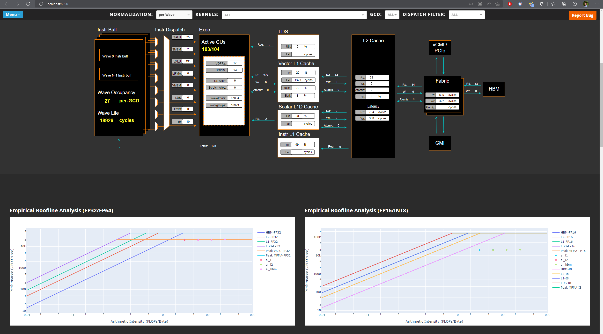

# Standalone GUI Analyzer

```eval_rst
.. toctree::
   :glob:
   :maxdepth: 4
```

## Features
Omniperf's standalone GUI analyzer is a lightweight web page that can be generated straight from the command-line. This option is great for users who want immediate access to graphical results without the server-side overhead of the Omniperf's detailed [Grafana interface](https://amdresearch.github.io/omniperf/grafana_analyzer.html#)

The standalone GUI analyzer is a simple Flask web application that uses port forwarding (DEFAULT: 8050) to allow users to view results from their web browser.

> Because the standalone GUI analyzer uses port forwarding we reccomend users who profile on shared clusters **scp** their results to their personal workstation for analysis.

## Useage

To launch the standalone GUI, users will include the `--gui` flag in their analysis command.

```{tip}
To launch the web application on a port other than 8050 (default)
use --gui <desired port>
```

```bash
$ omniperf analyze -p workloads/vcopy/mi200/ --gui

--------
Analyze
--------

Dash is running on http://0.0.0.0:8050/

 * Serving Flask app 'omniperf_cli.omniperf_cli' (lazy loading)
 * Environment: production
   WARNING: This is a development server. Do not use it in a production deployment.
   Use a production WSGI server instead.
 * Debug mode: off
 * Running on all addresses (0.0.0.0)
   WARNING: This is a development server. Do not use it in a production deployment.
 * Running on http://127.0.0.1:8050
 * Running on http://10.228.32.139:8050 (Press CTRL+C to quit)
```

Users can then lauch their web browser of choice and go to http://localhost:8050/ (substituting port if overridden).



When no filters are applied users will see 5 basic section derived from their application's profiling data:

1. Memory Chart Analysis
2. Empirical Roofline Analysis
3. Top Stats (Top Kernal Statistics)
4. System Info
5. System Speed-of-Light

To dive deeper, use the top drop down menus to isolate a particular kernel(s) or dispatch(s). You'll then see the webpage updates with metrics specific to the filter you've applied.

Once you've applied a filter you'll also see several additional sections become availible with detailed metrics specific to that area of AMD hardware. These detailed sections mirror the data we display in Omniperf's [Grafana interface](https://amdresearch.github.io/omniperf/grafana_analyzer.html#)

